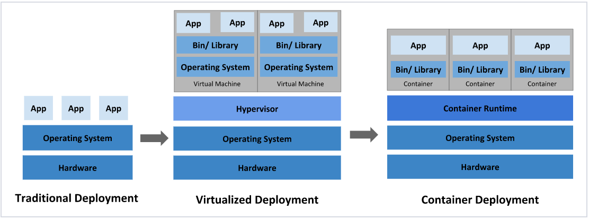
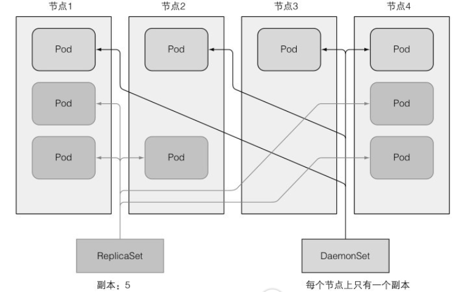
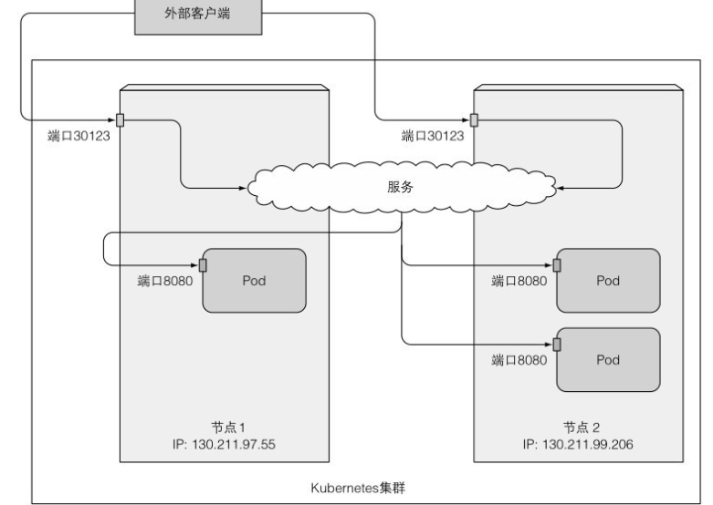
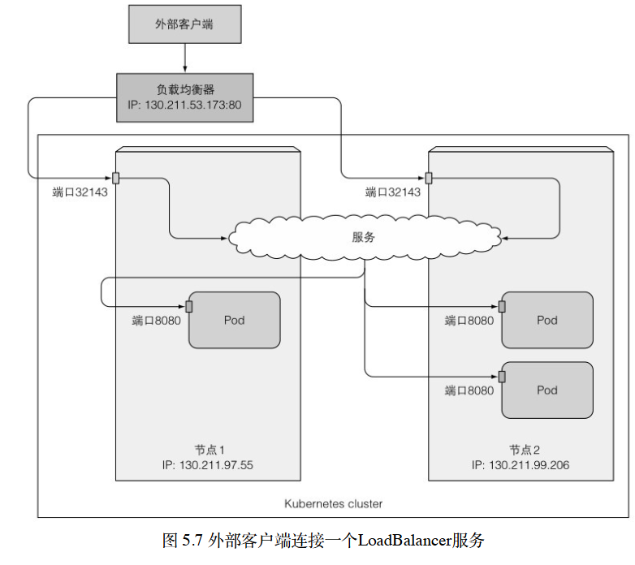
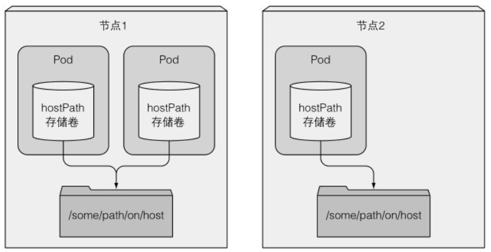
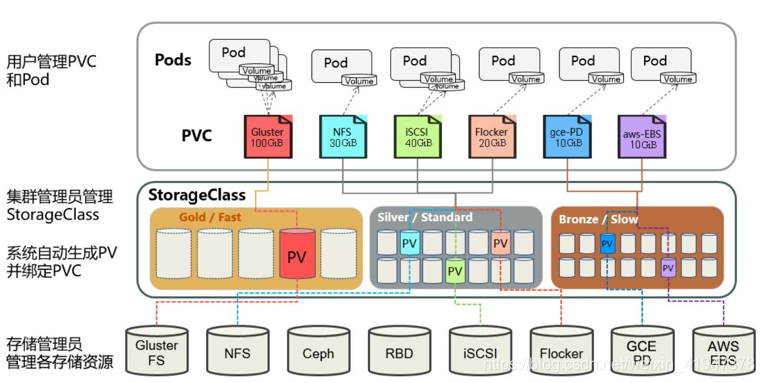
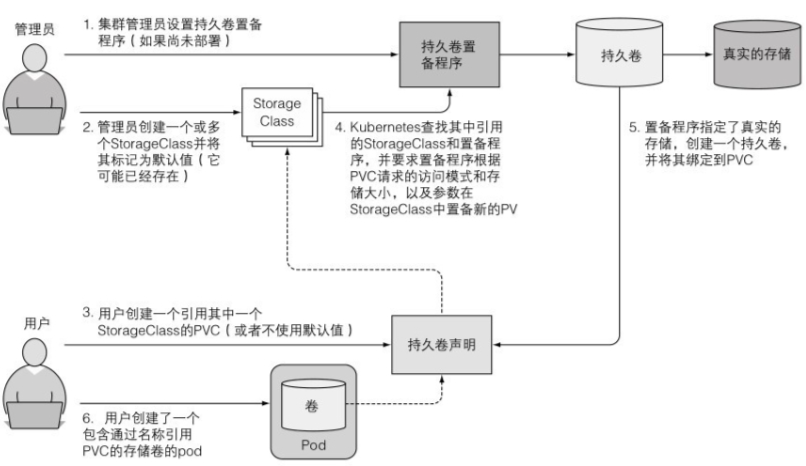
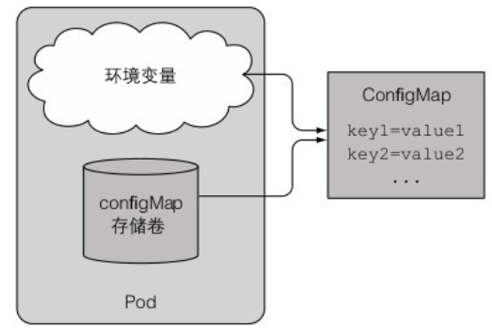
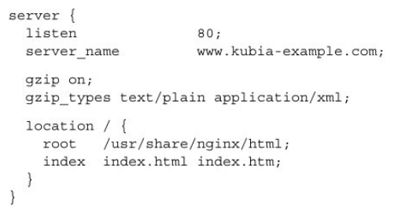
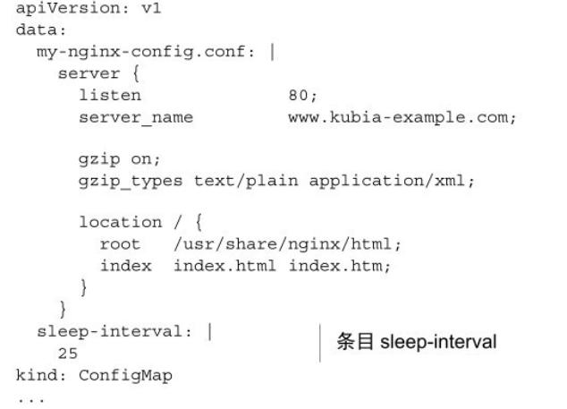

# 1. Kubernetes介绍

## 1.1 应用部署方式演变

在部署应用程序的方式上，主要经历了三个时代：

- **传统部署**：互联网早期，会直接将应用程序部署在物理机上

  > 优点：简单，不需要其它技术的参与
  >
  > 缺点：不能为应用程序定义资源使用边界，很难合理地分配计算资源，而且程序之间容易产生影响

- **虚拟化部署**：可以在一台物理机上运行多个虚拟机，每个虚拟机都是独立的一个环境

  > 优点：程序环境不会相互产生影响，提供了一定程度的安全性
  >
  > 缺点：增加了操作系统，浪费了部分资源

- **容器化部署**：与虚拟化类似，但是共享了操作系统

  > 优点：
  >
  > 可以保证每个容器拥有自己的文件系统、CPU、内存、进程空间等
  >
  > 运行应用程序所需要的资源都被容器包装，并和底层基础架构解耦
  >
  > 容器化的应用程序可以跨云服务商、跨Linux操作系统发行版进行部署
  >
  > 容器被设计为每个容器只运行一个进程（除非进程本身产生子进程）



容器化部署方式给带来很多的便利，但是也会出现一些问题，比如说：

- 一个容器故障停机了，怎么样让另外一个容器立刻启动去替补停机的容器
- 当并发访问量变大的时候，怎么样做到横向扩展容器数量

这些容器管理的问题统称为**容器编排**问题，为了解决这些容器编排问题，就产生了一些容器编排的软件：

- **Swarm**：Docker自己的容器编排工具
- **Mesos**：Apache的一个资源统一管控的工具，需要和Marathon结合使用
- **Kubernetes**：Google开源的的容器编排工具


**优点**：将一个应用程序解耦成多个组件，不同组件单独开发，单独迭代。组件之间通过定义良好的接口进行通信。

**缺点**：故障定位、代码调试困难，多个组件可能依赖不同版本的库，对共享库的管理提出较高要求。

## 1.2 k8s简介

k8s 就是一组服务器集群，它可以在集群的每个节点上运行特定的程序，来对节点中的容器进行管理，目的是实现资源管理的自动化。将实际硬件设备做抽象，然后将自身暴露成一个平台，用于部署和运行应用程序。

主要功能如下：

- **弹性伸缩**：根据需要，自动对集群中正在运行的容器数量进行调整
- **服务发现**：服务可以以自动发现的形式找到它所依赖的服务
- **负载均衡：**如果一个服务起了多个容器，能够自动实现需求的负载均衡
- **版本回退：**可以自定义回退到以前的版本
- **存储编排：**可以根据容器自身的需求自动创建存储卷

## 1.3 k8s组件

一个k8s集群由 控**制节点（master）**和**工作节点（node）**组成，每个节点安装不同的组件


**master**: 集群的控制平面，负责集群的决策管理；

- **ApiServer**: 资源操作的**唯一入口**，**接受用户输入的命令**，提供认证、授权、API注册和发现等机制。（控制该集群的唯一入口，开放给开发人员的）
- **Scheduler** : 负责**集群资源调度**，按照预定的调度策略将Pod调度到相应的node节点上（计算谁来干活）
- **ControllerManager：**  负责**维护**集群的状态，比如程序部署安排、故障检测、自动扩展、滚动更新等（发任务安排谁来干活的）
- **Etcd** ：（默认用的etcd，也可以用mysql或其他的）**负责存储集群中各种资源对象的信息**。

**node**：集群的数据平面，负责为容器提供运行环境（真正干活的）

- **Kubelet：**负责**维护容器的声明周期**，即通过控制docker，来创建、更新，销毁容器。（接收控制节点的信息并安排给下面的docker）
- **KubeProxy** : 负责提供集群内部的服务发现和负载均衡。（实际使用服务的用户的入口）
- **Docker** : 负责节点上容器的各种操作，k8s的所有节点（包括master和worker）上都有docker或其他容器运行时引擎（负责拉取镜像并运行）。通常情况下，k8s节点会从公共或私有的镜像仓库拉取镜像。某些特殊环境（离线）下，可以在每个节点都部署本地镜像仓库。

另外：

- **kubectl**：Kubernetes 提供 [kubectl]([命令行工具 (kubectl) | Kubernetes](https://kubernetes.io/zh-cn/docs/reference/kubectl/)) 是使用 Kubernetes API 与 Kubernetes 集群的[控制面](https://kubernetes.io/zh-cn/docs/reference/glossary/?all=true#term-control-plane)进行通信的**命令行工具**。


下面，以部署一个nginx服务来说明kubernetes系统各个组件调用关系：

1. 首先要明确，一旦kubernetes环境启动之后，master和node都会将自身的信息存储到etcd数据库中

2. 一个nginx服务的安装请求会首先被发送到master节点的apiServer组件

3. apiServer组件会调用scheduler组件来决定到底应该把这个服务安装到哪个node节点上

   在此时，它会从etcd中读取各个node节点的信息，然后按照一定的算法进行选择，并将结果告知apiServer

4. apiServer调用controller-manager去调度Node节点安装nginx服务

5. kubelet接收到指令后，会通知docker，然后由docker来启动一个nginx的pod

   pod是kubernetes的最小操作单元，容器必须跑在pod中至此，

6. 一个nginx服务就运行了，如果需要访问nginx，就需要通过kube-proxy来对pod产生访问的代理

这样，外界用户就可以访问集群中的nginx服务了。

## 1.4 kubernetes概念

**Master**：集群控制节点，每个集群需要至少一个master节点负责集群的管控

**Node**：工作负载节点，由master分配容器到这些node工作节点上，然后node节点上的docker负责容器的运行，一个worker node中有多个Pod。一个worker node 可能会属于多个namespace。

**Pod**：**kubernetes的最小控制单元，一个 pod 是一组紧密相关的容器，它们总是一起运行在同一个工作节点上，以及同一个 Linux 命名空间中。**（我们部署的程序要跑在容器里面，而容器需要跑在Pod里面，同一个pod中的多个容器一般会协同工作）。一个 pod 中的所有容器都运行在同一个逻辑机器上。

> 一般倾向于在pod中单独运行一个容器，pod应该包含的是密切耦合的容器组（通常是一个主容器和支持主容器的其他容器）
>
> 如果容器紧耦合并且需要共享磁盘等资源，则应将其编排在一个Pod中。
>
> 应该如何分组到pod中：当决定是将两个容器放入一个pod还是两个单独的pod时，我们需要问自己以下问题：
>
> 1. 它们需要一起运行还是可以在不同的主机上运行？
>
> 2. 它们代表的是一个整体还是相互独立的组件？
>
> 3. 它们必须一起进行扩缩容还是可以分别进行？
>
> 总之，容器不应该包含多个进程，pod也不应该包含多个并不需要运行在同一主机上的容器


**Controller**：控制器，通过它来实现对pod的管理，比如启动pod、停止pod、伸缩pod的数量等等

**Service**：pod对外服务的统一入口，下面可以维护者同一类的多个pod。服务表示 一组 或多组提供相同服务的 pod 的静态地址。pod被创建出来的时候具有不定的IP地址，为了对外提供统一的服务接口，需要service。

**Label**：标签，用于对pod（或其他k8s资源）进行分类，同一类pod会拥有相同的标签（控制器根据标签选择pod）

**NameSpace**：命名空间，用来隔离pod的运行环境（设置不同的命名空间可以使不同的pod相互访问或相互隔离）（**逻辑上的运行环境的分组**），Namespaces 用来对资源进行逻辑上的分隔，而不是物理上的分隔。Namespaces 主要用于在同一个 Kubernetes 集群中进行资源隔离和管理，它们并不限制 Pod 运行在哪台物理机或节点上。换句话说，**不同物理机上的 Pod 可以属于同一个 Namespace**。Namespace 主要作用于 Kubernetes 的 API 上，帮助分隔不同用户、团队或项目的资源和权限，而不管这些资源实际上部署在哪些物理节点上。**namespace的主要功能是逻辑隔离，资源分类，权限控制，资源配额管理。**每个namespace都有多个不同类型的东西。如pod，service，deployment等。

**Job：**用于一次性执行任务的资源对象。 主要用于执行一次性或短暂任务，例如批处理作业、数据处理作业、定时任务等。**Job 保证其所管理的 Pod 至少会运行一次，直到任务成功完成。**如果任务失败，Job 会重启 Pod，直到任务成功为止。


# 2. kubernetes集群环境搭建

k8s集群可以规划为：**一主多从**和**多主多从**。


本次搭建一主多从集群。

## 2.1 前置知识点

目前生产部署Kubernetes 集群主要有两种方式：

**kubeadm**

Kubeadm 是一个K8s 部署工具，提供kubeadm init 和kubeadm join，用于快速部署Kubernetes 集群。

官方地址：https://kubernetes.io/docs/reference/setup-tools/kubeadm/kubeadm/

**二进制包**

从github 下载发行版的二进制包，手动部署每个组件，组成Kubernetes 集群。

Kubeadm 降低部署门槛，但屏蔽了很多细节，遇到问题很难排查。如果想更容易可控，推荐使用二进制包部署Kubernetes 集群，虽然手动部署麻烦点，期间可以学习很多工作原理，也利于后期维护。

## 2.2 kubeadm 部署方式介绍

kubeadm 是官方社区推出的一个用于快速部署kubernetes 集群的工具，这个工具能通过两条指令完成一个kubernetes 集群的部署：

- 创建一个Master 节点`kubeadm init`
- 将Node 节点加入到当前集群中`$ kubeadm join <Master 节点的IP 和端口>`

## 2.3 安装要求

在开始之前，部署Kubernetes 集群机器需要满足以下几个条件：

- 一台或多台机器，操作系统ubuntu
- 硬件配置：2GB 或更多RAM，2 个CPU 或更多CPU，硬盘30GB 或更多
- 集群中所有机器之间网络互通
- 可以访问外网，需要拉取镜像
- 禁止swap 分区

## 2.4 最终目标

- 在所有节点上安装Docker 和kubeadm
- 部署Kubernetes Master
- 部署容器网络插件
- 部署Kubernetes Node，将节点加入Kubernetes 集群中
- 部署Dashboard Web 页面，可视化查看Kubernetes 资源

## 2.5 minikube

为方便学习，我们使用minikube进行单机ubuntu 部署k8s。

主要教程：

[Ubuntu20部署K8S单机版-CSDN博客](https://blog.csdn.net/Xin_101/article/details/122732950) （minikube启动时一定要使用方式3）

> ``` shell
> minikube start --registry-mirror=https://registry.docker-cn.com,https://shraym0v.mirror.aliyuncs.com --embed-certs=true --image-mirror-country=cn --base-image=gcr.io/k8s-minikube/kicbase:v0.0.44  --image-repository=registry.cn-hangzhou.aliyuncs.com/google_containers
> ```

https://vitalflux.com/install-kubernetes-ubuntu-vm

想要使用minikube里面的东西比如其中的docker，需要先登录进入 minikube 虚拟机，使用`minikube ssh`登录。

## 2.6 k8s集群配置信息

`~/.kube/config` 是 Kubernetes 集群的配置文件，用于存储与集群连接相关的信息，包括集群的地址、认证信息、上下文等。

当使用 `kubectl` 工具与 Kubernetes 集群进行交互时，`kubectl` 会读取这个配置文件来确定要连接的集群、使用的身份验证方式和当前上下文。

通常，`~/.kube/config` 文件的内容结构如下所示：

```
yaml复制apiVersion: v1
clusters:
- cluster:
    server: https://kubernetes-cluster-address
    certificate-authority-data: base64-encoded-certificate-authority
  name: cluster-name
contexts:
- context:
    cluster: cluster-name
    user: user-name
  name: context-name
current-context: context-name
kind: Config
preferences: {}
users:
- name: user-name
  user:
    client-certificate-data: base64-encoded-client-certificate
    client-key-data: base64-encoded-client-key
```

在这个文件中，您可以找到以下信息：

- `clusters` 部分包含了集群的连接信息，如服务器地址和 CA 证书。
- `contexts` 部分定义了上下文，包括了所使用的集群和用户。
- `users` 部分包含了身份验证信息，如客户端证书和密钥。

如果需要连接到不同的 Kubernetes 集群或使用不同的身份验证方式，可以在 `~/.kube/config` 文件中配置多个集群、上下文和用户，并使用 `kubectl config use-context` 命令来切换当前上下文。这样，您可以方便地在不同的环境中进行操作。

# 3. kubectl 命令

[命令行工具 (kubectl) | Kubernetes](https://kubernetes.io/zh-cn/docs/reference/kubectl/)

kubectl使用以下语法，在终端运行命令：

``` shell
kubectl [command] [TYPE] [NAME] [flags]
```

其中：

- `command`：指定要对一个或多个资源执行的操作，例如 `create`、`get`、`describe`、`delete`。
- `TYPE`：指定[资源类型](https://kubernetes.io/zh-cn/docs/reference/kubectl/#resource-types)。资源类型不区分大小写， 可以指定单数、复数或缩写形式。例如，以下命令输出相同的结果：
- `NAME`：指定资源的名称。名称区分大小写。 如果省略名称，则显示所有资源的详细信息。例如：`kubectl get pods`。
- `flags`： 指定可选的参数。例如，可以使用 `-s` 或 `--server` 参数指定 Kubernetes API 服务器的地址和端口。

[Kubectl命令速查表 | Joe Blog (jaegerw2016.github.io)](https://jaegerw2016.github.io/posts/2020/07/13/Kubectl命令速查表.html)

## **基础命令**

| 命令          | 说明                                                         |
| ------------- | ------------------------------------------------------------ |
| create        | 通过文件名或者标准输入**创建**资源，（已创建则返回错误）<br />  `-f, --filename`: 指定要创建的资源对象的配置文件。<br /> `--dry-run`: 在创建资源对象之前执行一次试运行，用于检查配置文件是否正确。 <br />`--validate`: 校验配置文件的有效性，检查是否符合 Kubernetes 对象的规范。<br /> `-o, --output`: 指定输出格式，可以使用的格式包括 json、yaml 等。 <br />`--edit`: 在创建资源对象之前编辑配置文件。<br /> `--namespace`: 指定要创建资源对象的命名空间。<br /> `--save-config`: 将当前配置保存到资源对象的注释中，以供后续更新使用。<br /> `--record`: 记录此次操作的历史记录。<br /> `--image`: 创建 Pod 时指定容器镜像。<br /> `--port`: 创建 Service 时指定端口号。 |
| expose        | 将一个资源公开为一个新的Service                              |
| run           | 在集群中运行一个特定的镜像                                   |
| set           | 在对象上设置特定的功能。<br />常用在修改pod、rs、deploy、ds、job等的镜像中。<br />如：`kubectl set image deployment deploy名 镜像名=新版本号` |
| explain       | 文档参考资料                                                 |
| get           | 显示一个或多个资源（pod node service 等）<br />  `-o, --output`: 指定输出格式，可以使用的格式包括 wide、json、yaml 等。<br /> `--namespace`: 指定要获取 Pods 信息的命名空间。 <br />`--all-namespaces` 或 `-A`: 获取所有命名空间中的 Pods 信息。<br /> `--selector`: 根据标签选择器来过滤要显示的 Pods。<br /> `--show-labels`: 显示 Pods 的标签信息。 <br />`--sort-by`: 指定排序依据，可以根据 CreationTimestamp、Name 等字段进行排序。<br /> `--field-selector`: 根据字段选择器来过滤要显示的 Pods。<br /> `--watch`: 实时监视 Pods 的变化。 |
| edit          | 使用默认的编辑器编辑一个资源                                 |
| delete        | 通过文件名、标准输入、资源名称或标签选择器来删除资源         |
| api-resources | 查看k8s集群所有的资源及其对应的缩写、版本、类型              |

## **集群部署命令**

| 命令           | 说明                                               |
| -------------- | -------------------------------------------------- |
| rollout        | 管理资源的发布                                     |
| rolling-update | 对给定的复制控制器滚动更新                         |
| scale          | 扩容或缩容Pod数量，Deployment、ReplicaSet、RC或Job |
| autoscale      | 创建一个自动选择扩容或缩容并设置Pod数量            |

## **集群管理命令**

| 命令         | 说明                                                 |
| ------------ | ---------------------------------------------------- |
| certificate  | 修改证书资源                                         |
| cluster-info | 显示集群信息                                         |
| top          | 显示资源（CPU/Memory/Storage）使用。需要Heapster运行 |
| cordon       | 标记节点不可调度                                     |
| uncordon     | 标记节点可调度                                       |
| drain        | 驱逐节点上的应用，准备下线维护                       |
| taint        | 修改节点taint标记                                    |

## **故障和调试命令**

| 命令         | 说明                                                         |
| ------------ | ------------------------------------------------------------ |
| describe     | `kubectl describe 资源类型 资源名`显示特定资源或资源组的详细信息 |
| logs         | `kubectl logs pod名 [-c 容器名]`，在一个Pod中打印一个容器日志。如果Pod只有一个容器，容器名称是可选的，报的不是pod 的错，是容器的错 |
| attach       | 附加到一个运行的容器                                         |
| exec         | 执行命令到容器: `kubectl exec -it pod名 -c 容器名 -- /bin/bash`。bash命令可以换成其他。不指定-c 容器就会在pod中直接执行 |
| port-forward | 转发一个或多个本地端口到一个pod                              |
| proxy        | 运行一个proxy到kubernetes API server                         |
| cp           | 拷贝文件或目录到容器中                                       |
| auth         | 检查授权                                                     |

## **高级命令**

| 命令    | 说明                                                         |
| ------- | ------------------------------------------------------------ |
| apply   | 通过文件名或标准输入对资源应用配置（**创建或更新**）         |
| patch   | 使用补丁修改、更新资源的字段                                 |
| replace | 通过文件名或标准输入替换一个资源，运行此命令要求对象之前存在 |
| convert | 不同的API版本之间转换配置文件                                |

## **设置命令**

| 命令       | 说明                        |
| ---------- | --------------------------- |
| label      | 更新资源上的标签            |
| annotate   | 更新资源上的注释            |
| completion | 用于实现kubectl工具自动不全 |

## **其他命令**

| 命令          | 说明                                                |
| ------------- | --------------------------------------------------- |
| api-versions  | 打印支持的API版本                                   |
| api-resources | 打印支持的服务器资源API                             |
| config        | 修改kubeconfig文件（用于访问API，比如配置认证信息） |
| help          | 所有命令帮助                                        |
| plugin        | 运行一个命令行插件                                  |
| version       | 打印客户端和服务版本信息                            |

## 常用选项说明

- `-A, --all-namespaces`: 在所有命名空间中执行操作。
- `--context`: 指定使用的集群上下文。可以使用 `--context` 选项来指定要操作的集群上下文。
- `-f, --filename`: 指定要操作的资源的配置文件。使用 `-f` 选项可以直接通过配置文件来创建、更新或删除资源。
- `-h, --help`: 显示帮助信息。使用 `-h` 选项可以显示命令的帮助信息，包括可用选项和用法示例。
- `--kubeconfig`: 指定 kubeconfig 文件的路径。使用 `--kubeconfig` 选项可以指定要使用的 kubeconfig 文件的路径。
- `-l, --selector`: 使用标签选择器来过滤资源。
- `-n, --namespace`: 指定操作的命名空间。
- `-o, --output`: 指定输出的格式。可以使用 `-o` 选项来指定输出结果的格式，如 `yaml`、`json`、`wide` 等。
- `-v, --v`: 设置日志级别。可以使用 `-v` 选项来设置日志级别，用于调试和详细输出信息。

**示例**

`kubectl get pod -A`：显示在所有命名空间 (`-A` 参数表示全局) 中的 Pod 列表。（不加-A参数则默认只显示当前namespace空间下的pod）

``` txt
NAMESPACE              NAME                     READY   STATUS                   RESTARTS       AGE
test-523-1             test-523-1-etcd-1        2/2     Running                  0               42d
test-523-1             test-523-1-etcd-2        1/1     Running                  0               42d
test-rxy-523-2         test-rxy-523-2-etcd-0    0/1     InvalidImageName         0               15m
test-rxy-523-2         test-rxy-523-2-etcd-1    0/1     InvalidImageName         0               39d
test-rxy-523-2         test-rxy-523-2-etcd-2    0/1     InvalidImageName         0               41d
volcano-system         volcano-admission-56     1/1     Running                  0               9d
zh-4                   test-cluster-4-co...     0/1     ContainerCreating        0               54d
```

返回的每行数据的含义如下：

- `NAMESPACE`: Pod 所属的命名空间
- `NAME`: Pod 的名称
- `READY`: Pod 的就绪副本数/总副本数
- `STATUS`: Pod 的运行状态
- `RESTARTS`: 重启次数
- `AGE`: Pod 运行时间

# 4. Pod使用

## 创建Pod

一般使用YAML文件来创建Pod，也可以使用kubectl run命令运行一个特定的镜像来创建pod，但这些方法通常只允许你配置一组有限的属性。

yaml描述文件可以创建所有k8s资源。通过将yaml文件提交到k8s  API服务器来创建这些资源。

DaemonSet的目的是运行系统服务，即使是在不可调度的节点上，系统服务通常也需要运行。

### 查看的pod的yaml描述

``` shell
$ kubectl get pod test -o yaml  # 查看名为test的pod的yaml内容
apiVersion: v1	# 使用的k8s API版本
kind: Pod		# k8s对象（资源类型）
metadata:
	... 	# pod元数据（名称，标签和注解）
spec:
	...		# pod规格，内容
status:
	... 	# pod及其内部容器的详细状态
```

可以使用 `kubectl explain pod` 来得到 pod 具有的上述属性的官方描述。并且可以进一步使用 `kubectl explain pod.spec` 来获得具体的spec 的描述。

### 编写yaml描述文件

``` yaml
apiVersion: v1	# 使用的k8s API版本
kind: Pod # 描述的资源类型，yaml可以描述任意资源
metadata:
  name: test-lt1 # pod的名称，所有的命名只能是数字字母或-或.
spec:
  containers:
  - image: ubuntu # 创建容器所使用的镜像
    name: test-c1	# 创建的容器的名字
    command: ["sleep", "120"]	# 给容器加一个任务，不然容器没有任务开启就立马关闭了 
    ports:
    - containerPort: 8080 # 应用监听的端口
      protocol: TCP
```

### 使用kubectl create创建pod

``` shell
$ kubectl create -f t1.yaml
pod/test-lt1 created
```

创建之后发现有问题可以使用命令 `kubectl delete pod test-lt1` 删除


## 标签使用

使用标签可以对众多pod（当然也可以给其他任何资源）进行分类管理。

通过给这些pod添加标签，可以得到一个更组织化的系统，以便我们理解。此时每个pod都标有两个标
签：

- app，它指定pod属于哪个应用、组件或微服务。（**基于应用的横向维度**）
- rel ， 它 显 示 在 pod 中 运 行 的 应 用 程 序 版 本 是 stable 、 beta 还 是
  canary（**基于版本的纵向维度**）

k8s 的标签以键值对的形式进行标记。

### 标签查询

``` shell
kubectl get pod [pod名] --show-labels 	# 展示标签
kubectl get pod -L label1, label2		 # 展示带有这两个标签的pod（或选择）
kubectl get pod -l label1, label2		 # 展示带有这两个标签的pod（与选择）
```

### 创建pod时指定标签

``` yaml
...
metadata:
  name: xxx
  labels: 
    creation_method: manual
    env: prod
    aaa: bbb
...
```

### 新增修改删除标签

``` shell
kubectl label pod pod名 label键=label值  	# 新增
kubectl label pod pod名 label键=label值 --overwrite  	# 修改
kubectl label pod pod名  label键-		# 删除
```

其他pod 可以换成任意资源。

### 标签约束调度

k8s创建的所有pod都是近乎随机地调度到工作节点上的，这是正确的。但有时我们需要对pod的位置有一定约束。比如需要将执行GPU密集型运算的pod调度到实际提供GPU加速的节点上。

我们不会特别说明pod应该调度到哪个节点上，因为这将会使应用程序与基础架构强耦合，从而违背了**Kubernetes对运行在其上的应用程序隐藏实际的基础架构**的整个构想。但如果你想对一个pod应该调度到哪里拥有发言权，那就**不应该直接指定一个确切的节点，而应该用某种方式描述对节点的需求**，使Kubernetes选择一个符合这些需求的节点。这恰恰可以**通过节点标签和节点标签选择器**完成。

使用标签 选择器将 pod 调度到有相应标签的特定节点，在新建pod 的yaml文件中：

``` yaml
spec: 
  nodeSelector:
    label键: "label值"
```

## k8s命名空间

K8s资源可以拥有多个标签，这些对象组可以重叠。但我们又希望将对象分割成完全独立且不重叠的组，此时需要使用命名空间namespace。k8s中的namespace 与用于相互隔离进程的Linux 命名空间不一样，它简单地为对象提供了一个**逻辑上的作用域**。因此不同命名空间中的资源可以重名。

每个namespace都有多个不同类型的东西。如pod，service，deployment等，对这些资源进行逻辑上的分组。

**注意：**kubectl在对资源进行操作时，如果不指定命名空间，默认会在上下文配置的默认命名空间（一般是 default 命名空间）中执行操作。如果要列出、描述、修改或删除其他命名空间中的对象，需要给 kubectl 命令传递 `--namespace`或`-n` 选项。

### 查看命名空间

``` shell
kubectl get ns  # 查看该k8s集群中所有的命名空间
kubectl get pod -n 命名空间名	# 展示指定命名空间下的所有pod，-n 是 --namespace的缩写
```


一般新建的k8s集群都会有这几个namespace。我们创建pod时不指定namespace就会在default命名空间中创建。

### 创建命名空间

同样使用yaml文件来创建命名空间。t2.yaml 内容如下

``` yaml
apiVersion: v1
kind: Namespace
metadata:
  name: test-0705
```

使用如下命令完成创建：

``` shell
kubectl create -f t2.yaml
```

也可以像下面代码一样简单地创建：

``` shell
kubectl create namespace test-0705
```

### 创建资源时指定命名空间

创建资源时，在yaml文件 metadata 字段添加如下属性，可以指定namespace

``` yaml
...
metadata:
  namespace: test-0705
...
```

如果不在文件中指定，可以在创建的命名中带参数写上

``` shell
kubectl create -f 文件名.yaml -n test-0705
```

## 在pod中执行

有时我们需要在pod或者容器中执行命令完成调试。此时可以使用 exec 命令

``` shell
kubectl exec [POD] [COMMAND] [OPTIONS]
```

- `POD`：要在其内部执行命令的 Pod 的名称或者 Pod 的标签选择器。
- `COMMAND`：要在 Pod 内部执行的命令。可以是一个单独的命令，也可以是多个命令以及参数。
- `OPTIONS`：可以附加一些选项，例如 `-i`（保持标准输入打开）、`-t`（为命令分配伪终端）、`--container`（指定容器名称）等。

`kubectl exec` 命令的一些常见用途包括：

> 双横杠（--）代表着kubectl命令项的结束。在两个横杠之后的内容是指在pod内部需要执行的命令。

1. 进入pod 的bash命令行：`kubectl exec my-pod -it -- bash`
2. 查看 Pod 内部的文件系统：例如 `kubectl exec my-pod -- ls /var/log` 可以列出 Pod 内 `/var/log` 目录的内容。
3. 运行调试命令：可以在 Pod 中运行一些调试命令来诊断问题，比如 `kubectl exec my-pod -- ps aux` 查看进程信息。
4. 执行管理命令：有时候需要在 Pod 中执行一些管理操作，例如重新加载配置文件等。

## 停止和删除pod

### 按名称删除

``` shell
kubectl delete pod pod名1 pod名2
```

在删除pod的过程中，实际上我们在指示Kubernetes终止该pod中的 所有容器。Kubernetes向进程发送一个SIGTERM信号并等待一定的秒数 （ 默 认 为 30 ） ， 使 其 正 常 关 闭 。 如 果 它 没 有 及 时 关 闭 ， 则 通 过 SIGKILL终止该进程。因此，为了确保你的进程总是正常关闭，进程 需要正确处理SIGTERM信号。

### 按标签删除

``` shell
kubectl delete pod -l 标签名[=标签值]
```

### 删除命名空间

删除命名空间时，会其中的所有pod一并删除

``` shell
kubectl delete ns 命名空间名
```

### 删除所有pod

我们可以使用命令删除命名空间中的所有pod

``` shell
kubectl delete pod --all
```

如果发现还有pod存在，检查是否有 ReplicationController 或 ReplicaSet 或  DaemonSet，它会在特定pod被删除后再次启动一个相应的pod。

### 清空命名空间

``` shell
kubectl delete all --all
```

命令中第一个all指定资源，而--all选项指定将删除所有资源实例，而不是按名称指定它们。

有一些资源如 secret 只会被明确指定删除。

删除资源时，kubectl将打印它删除的每个资源的名称。

# 5. 托管pod

比较简单的pod保活机制是设置存活探针，对pod的状态以及pod内容器部署的应用定时进行状态检查。详情见 《kubernetes in action》中文版4.1节。该机制存在一定缺陷，存活探针的任务由承载pod节点的kubelet执行，如果该节点本身崩溃，该探针任务就会失效。因此，推荐使用**ReplicationController** 或类似的机制来管理pod。

## ReplicationController

ReplicationController是一种 k8s 资源。如果pod因任何原因消失，其会创建新的pod来代替之前的。一般而言 ，ReplicationController 旨在创建和管理一个pod的多个副本（replicas）

ReplicationController 由三部分组成：

- **label selector**（标签选择器）：用于确定ReplicationController作用
  域中有哪些pod
- **replica count**（副本个数）：指定应运行的pod数量
- **pod template**（pod模板）：用于创建新的pod副本

ReplicationController的副本个数、标签选择器，甚至是pod模板都可以随时修改，但只有副本数目的变更会影响现有的pod

### 创建

``` yaml
apiVersion: v1
kind: ReplicationController
metadata:
  name: rc-lt
spec:
  replicas: 3
  selector: 
    test_aaa: test_bbb # 在此处不指定选择器也是一种选择。在这种情况下，它会自动根据pod模板中的标签自动配置。这样使YAML更加简短。
  template:
    metadata:
      labels: 
        test_aaa: test_bbb
    spec:
      containers:
        - image: aiops-899f5654.ecis.huhehaote-1.cmecloud.cn/public/nginx
          name: test-c1
          ports:
          - containerPort: 8080
            protocol: TCP
```

创建命令：

``` shell
kubectl create -f create-rc.yaml
```

此时查看是否创建成功：

``` shell
$ kubectl get rc -A
NAMESPACE   NAME    DESIRED   CURRENT   READY   AGE
default     rc-lt   3         3         3       12s
```

可以看到，再default 命名空间中创建了指定的replicationController并正常工作了。

``` shell
$ kubectl get pod
NAME                READY   STATUS      RESTARTS    AGE
.........
rc-lt-8trmx          1/1     Running    0          2m37s
rc-lt-jlnlm          1/1     Running    0          2m37s
rc-lt-zwbl5          1/1     Running    0          2m37s
```

### 删除

此时，我们删除一个pod

``` shell
kubectl delete pod rc-lt-8trmx
```

然后再次查看

``` shell
$ kubectl get pod
NAME                READY   STATUS      RESTARTS    AGE
rc-lt-98fkv         1/1     Running     0           5s
rc-lt-jlnlm         1/1     Running     0          6m40s
rc-lt-zwbl5         1/1     Running     0          6m40s
```

可以看到，删除之后，rc快速地为我们创建了一个副本。

### 查看详细信息

``` shell
$ kubectl describe rc rc-lt
Name:         rc-lt
Namespace:    default
Selector:     test_aaa=test_bbb
Labels:       test_aaa=test_bbb
Annotations:  <none>
Replicas:     3 current / 3 desired
Pods Status:  3 Running / 0 Waiting / 0 Succeeded / 0 Failed
Pod Template:
  Labels:  test_aaa=test_bbb
  Containers:
   test-c1:
    Image:        aiops-899f5654.ecis.huhehaote-1.cmecloud.cn/public/nginx
    Port:         8080/TCP
    Host Port:    0/TCP
    Environment:  <none>
    Mounts:       <none>
  Volumes:        <none>
Events:
  Type    Reason            Age    From                    Message
  ----    ------            ----   ----                    -------
  Normal  SuccessfulCreate  8m49s  replication-controller  Created pod: rc-lt-8trmx
  Normal  SuccessfulCreate  8m49s  replication-controller  Created pod: rc-lt-zwbl5
  Normal  SuccessfulCreate  8m49s  replication-controller  Created pod: rc-lt-jlnlm
  Normal  SuccessfulCreate  2m14s  replication-controller  Created pod: rc-lt-98fkv
```

### 控制器如何创建新的pod

控制器通过创建一个新的替代pod来响应pod的删除操作。从技术上讲，**它并没有对删除本身做出反应**，而是针对由此产生的状态 —— pod数量不足。

虽然ReplicationController会立即收到删除pod的通知（API服务器允许客户端监听资源和资源列表的更改），但这不是它创建替代pod的原因。该通知会触发控制器检查实际的pod数量并采取适当的措施。

### 更改RC的标签选择器

- 如果更改了一个pod的标签，使它不再与ReplicationController的标签选择器相匹配，那么该pod就变得和其他手动创建的pod一样了。它不再被任何东西管理。如果运行该节点的pod异常终止，它显然不会被重新调度。但请记住，当你更改pod的标签时，ReplicationController发现一个pod丢失了，并启动一个新的pod替换它
- 如果给一个pod新增标签，那么 rc 不会有任何反应。因为rc 检查的是自己的标签选择器，只要pod具有自己的标签选择器的所有标签，那么该pod就收到自己的管理。

- 如果不是更改某个pod的标签而是**修改了ReplicationController的标签选择器**，它会让所有已创建的pod脱离ReplicationController的管理，导致它创建三个新的pod。

### 修改pod模板

ReplicationController的pod模板可以随时修改。pod模板修改后，原有的pod不会被删除，rc会自动新建新的pod。

通过编辑rc 并向pod模板进行编辑或修改

``` shell
kubectl edit rc rc-lt
```

在打开的文本编辑器中修改。

### RC扩缩容

放大或者缩小pod的数量规模使用修改 Replicas 字段的值来实现，更改之后，ReplicationController将会看到存在太多的pod并删除其中的一部分（缩容时），或者看到它们数目太少并创建pod（扩容时）。

``` shell
kubectl scale rc rc-lt --replicas=10
```

也可以通过编辑rc 进行修改

``` shell
kubectl edit rc rc-lt
```

在打开的文本编辑器中修改。

### 删除rc

使用命令

``` shell
kubectl delete rc rc名
```

将指定的rc进行删除，当删除此rc时，**此rc所管理的pod也会被删除。**但是由于由 ReplicationController 创 建 的 pod 不 是 ReplicationController的组成部分，只是由其进行管理，因此可以只删除 ReplicationController并保持pod运行。

``` shell
kubectl delete rc rc名 [--casade=false]
```

加上后面的那些参数可以在删除rc后保留pod。

## ReplicaSet

ReplicaSet是完全代替ReplicationController的资源。**使用 rs 而不要使用rc**。它们几乎完全相同。

不同在于rs的pod选择器的表达能力更强。比如rs的标签选择器不仅允许包含某个标签的pod，还可以匹配缺少某个标签的pod，或者包含特定标签名的pod。

### 创建ReplicaSet

``` yaml
apiVersion: apps/v1   # api组/api实际版本，可使用kubectl get rs rs名 -o=jsonpath='{.apiVersion}' 查看已有的rs来获得
kind: ReplicaSet
metadata:
  name: rs-lt
spec:
  replicas: 3
  selector:
    matchLabels: # 最简单的类似rc的选择器
      test_aaa: test_bbb
  template:
    metadata:
      labels: 
        test_aaa: test_bbb
    spec:
      containers:
        - image: aiops-899f5654.ecis.huhehaote-1.cmecloud.cn/public/nginx
          name: test-c1
          ports:
          - containerPort: 8080
            protocol: TCP
```

上述文件内容命名一个文件 `create-rs.yaml`，使用命令创建 rs

``` shell
kubectl create  -f create-rs.yaml
```

然后使用命令查看资源项

``` shell
$  kubectl get rs
NAME   DESIRED   CURRENT   READY   AGE
rs-lt  3         3         3       29s

$ kubectl get  pod
NAME         READY    STATUS    RESTARTS      AGE
rs-lt-k8zbl   1/1     Running     0            3s
rs-lt-wt2xb   1/1     Running     0            3s
test-lt1      1/1     Running     0            15h
```

可以看到，rs成功被创建，但保证了有三个按模板的 pod正在运行。但是它只新建了两个 pod，这是因为15h之前我们就手动创建了一个带有相应标签的pod，rs 创建之后发现了它并把它纳入管辖，因为就只需要新建两个。总的来说rs中的副本数字段其实是表示需要有这么多个pod运行而不是要求新建这么多个。

删除rs 同样使用 delete

``` shell
kubectl delete rs rs-lt 
```

该rs 管辖的所有pod全部自动删除了。

### 标签选择器

``` yaml
selector:
  matchExpressions:  
   - key: app
     operator: In
     values:
       - qwe
```

可以给选择器添加额外的表达式。如示例，每个表达式都必须包含一个key、一个operator（运算符），并且可能还有一个values的列表（取决于运算符）。你会看到四个有效的运算符：

- In:Label的值必须与其中一个指定的values匹配。
- NotIn:Label的值与任何指定的values不匹配。
- Exists:pod必须包含一个指定名称的标签（值不重要）。使用此运算符时，不应指定values字段。
- DoesNotExist:pod不得包含有指定名称的标签。values属性不得指定。

如果你指定了多个表达式，则所有这些表达式都必须为true才能使选择器与pod匹配。如果同时指定matchLabels和matchExpressions，则所有标签都必须匹配，并且所有表达式必须计算为true以使该pod与选择器匹配。

## DaemonSet

某些应用需要在每个node中都运行，如日志收集和资源监控。此时可以使用DaemonSet来实现 。



由上图可以看出DaemonSet和ReplicaSet的区别：

- ReplicaSet 确保集群中存在期望数量的pod副本，
- DaemonSet 无需指定副本数，它确保一个pod匹配它的选择器并在每个节点上运行。

### 在指定节点运行

DaemonSet将pod部署到集群中的所有（worker）节点上，除非指定这些pod只在部分节点上运行。这是通过pod模板中的`nodeSelector`属性指定的。

``` yaml
apiVersion: apps/v1   # api组/api实际版本
kind: DaemonSet
metadata:
  name: ds-lt
spec:
  selector:
    matchLabels: # 匹配的pod 的标签
      test_aaa: test_bbb
  template:
    metadata:
      labels: 
        test_aaa: test_bbb # 创建的pod 的标签
    spec:
      nodeSelector:		# 在此处指定节点选择器	
        nodeKey: nodeValue
      containers:
        - image: cis-hub-huadong-4.cmecloud.cn/ecloud/busybox:config-host
          name: test-c1
          command: ["sleep", "1200"]
          ports:
          - containerPort: 8080
            protocol: TCP
```

编写上述yaml文件并运行创建。

``` shell
$ kubectl create -f ds1.yaml 
daemonset.apps/ds-lt created
$ kubectl  get pod
No resources found in default namespace.
$ kubectl  get ds
NAME    DESIRED   CURRENT   READY   UP-TO-DATE   AVAILABLE   NODE SELECTOR       AGE
ds-lt   0         0         0       0            0           nodeKey=nodeValue   13s
```

我们发现 ds 并没有按要求创建pod，这是因为我们的两个node 还没有相应的标签。打上标签之后，DaemonSet将**自动检测到节点的标签已经更改**，并将pod部署到有匹配标签的所有节点。

``` shell
$ kubectl get node
NAME                 STATUS   ROLES                  AGE   VERSION
kcs-suzhou-m-596vf   Ready    control-plane,master   23h   v1.21.5
kcs-suzhou-m-n5pzs   Ready    control-plane,master   23h   v1.21.5
kcs-suzhou-m-prn28   Ready    control-plane,master   23h   v1.21.5
kcs-suzhou-s-grdfq   Ready    <none>                 23h   v1.21.5
kcs-suzhou-s-r68kp   Ready    <none>                 23h   v1.21.5
$ kubectl label node kcs-suzhou-s-grdfq kcs-suzhou-s-r68kp nodeKey=nodeValue
node/kcs-suzhou-s-grdfq labeled
node/kcs-suzhou-s-r68kp labeled
$ kubectl  get ds
NAME    DESIRED   CURRENT   READY   UP-TO-DATE   AVAILABLE   NODE SELECTOR       AGE
ds-lt   2         2         2       2            2           nodeKey=nodeValue   3m31s
$ kubectl get pod
NAME          READY   STATUS    RESTARTS   AGE
ds-lt-n682s   1/1     Running   0          54s
ds-lt-nkn8r   1/1     Running   0          54s
```

此时我们删除一个pod 的标签

``` shell
$ kubectl get  pod --show-labels
NAME          READY   STATUS    RESTARTS   AGE     LABELS
ds-lt-n682s   1/1     Running   0          4m42s   controller-revision-hash=78755b8f7f,pod-template-generation=1,test_aaa=test_bbb
ds-lt-nkn8r   1/1     Running   0          4m42s   controller-revision-hash=78755b8f7f,pod-template-generation=1,test_aaa=test_bbb
$ kubectl label pod ds-lt-n682s test_aaa-
pod/ds-lt-n682s labeled
$ kubectl get  pod --show-labels
NAME          READY   STATUS    RESTARTS   AGE     LABELS
ds-lt-fhjjm   1/1     Running   0          3s      controller-revision-hash=78755b8f7f,pod-template-generation=1,test_aaa=test_bbb
ds-lt-n682s   1/1     Running   0          5m47s   controller-revision-hash=78755b8f7f,pod-template-generation=1
ds-lt-nkn8r   1/1     Running   0          5m47s   controller-revision-hash=78755b8f7f,pod-template-generation=1,test_aaa=test_bbb
```

可以看见，pod ds-lt-n682s由于缺少 test_aaa标签脱离了daemon 的管理，于是daemon 立刻新建了一个pod来代替。

### 删除ds

``` shell
kubectl delete ds ds-lt
```

删除ds 会将它管理的所有pod 删除。

## Job

某些任务我们希望它只执行一次，**完成后**就终止，出错没完成就重启。Kubernetes通过Job资源提供了对此的支持。它允许你运行一种pod，该pod在**内部进程成功结束时，不重启容器。**一旦任务完成，pod就被认为处于完成状态。

在发生节点故障时，该节点上由Job管理的pod将按照ReplicaSet的
pod的方式，重新安排到其他节点。如果进程本身异常退出（进程返回
错误退出代码时），可以将Job配置为重新启动容器。

### 创建Job

``` yaml
apiVersion: batch/v1
kind: Job
metadata: 
  name: job1
spec:
  template:
    metadata:
      labels: 
        qw: er
    spec:
      restartPolicy: OnFailure  # 重启策略设为失败时重启
      containers:
      - name: c1
        image: cis-hub-huadong-4.cmecloud.cn/ecloud/busybox:config-host
        command: ["sleep", "120"] 
      nodeSelector: # 可以通过节点选择器指定pod会被调度到哪个节点
        nodekey: nodeValue
```

在一个pod的定义中，可以指定在容器中运行的进程结束时， Kubernetes会做什么。这是通过pod配置的属性restartPolicy完成的，**默认为Always。Job pod不能使用默认策略，**因为它们不是要无限期地运 行。因此，需要明确地**将重启策略设置为OnFailure或Never**。此设置防止容器在完成任务时重新启动（pod被Job管理时并不是这样的）。

### 运行

``` shell
$ kubectl create -f job1.yaml 
job.batch/job1 created
$ kubectl get pod
NAME          READY   STATUS    RESTARTS   AGE
job1-5phhv    1/1     Running   0          9s
```

两分钟过后，pod将不再出现在pod列表中，工作将被标记为已完成。默认情况下，除非使用--show-all（或-a）开关，否则在列出pod时不显示已完成的pod

``` shell
$ kubectl get pod -A
NAMESPACE   NAME        READY   STATUS      RESTARTS   AGE
default     job1-5phhv  0/1     Completed    0          2m51s
$ kubectl get job
NAME   COMPLETIONS   DURATION   AGE
job1   1/1           2m2s       4m22s
```

### job中运行多个实例

作业可以配置为创建多个pod实例，并以**并行或串行**方式运行它们。这是通过在Job配置中设置completions和parallelism属性来完成的。

**顺序运行Job pod**

将completions设为你希望作业的pod运行多少次，

``` yaml
apiVersion: batch/v1
kind: Job
metadata: 
  name: job1
spec:
  completions: 3 # 顺序运行3次
  template:
    metadata:
      labels: 
        qw: er
    spec:
      restartPolicy: OnFailure  # 重启策略设为失败时重启
      containers:
      - name: c1
        image: cis-hub-huadong-4.cmecloud.cn/ecloud/busybox:config-host
        command: ["sleep", "30"] 
```

运行后查看：

``` shell
$ kubectl create -f  job2.yaml 
job.batch/job1 created
$ kubectl get job
NAME   COMPLETIONS   DURATION   AGE
job1   0/3           8s         8s
$ kubectl get pod
NAME         READY   STATUS    RESTARTS   AGE
job1-vksk6   1/1     Running   0          17s
```

一定时间后：

``` shell
$ kubectl get job
NAME   COMPLETIONS   DURATION   AGE
job1   3/3           94s        2m38s
$ kubectl get pod
NAME         READY   STATUS      RESTARTS   AGE
job1-799sn   0/1     Completed   0          2m10s
job1-8n9g6   0/1     Completed   0          99s
job1-vksk6   0/1     Completed   0          2m42s
```

**并行运行job**

不必一个接一个地运行单个Job pod，也可以让该Job并行运行多个pod。可以通过parallelism Job配置属性，指定允许多少个pod并行执行。

``` yaml
apiVersion: batch/v1
kind: Job
metadata: 
  name: job1
spec:
  completions: 3 # 要求一共运行3次
  parallelism: 2 # 最多同时运行2个pod
  template:
    metadata:
      labels: 
        qw: er
    spec:
      restartPolicy: OnFailure  # 重启策略设为失败时重启
      containers:
      - name: c1
        image: cis-hub-huadong-4.cmecloud.cn/ecloud/busybox:config-host
        command: ["sleep", "30"] 
```

运行后查看：

``` shell
$ kubectl get job
NAME   COMPLETIONS   DURATION   AGE
job1   0/3           15s        15s
$ kubectl get pod
NAME         READY   STATUS    RESTARTS   AGE
job1-g44gn   1/1     Running   0          20s
job1-s8p42   1/1     Running   0          20s
```

可以在运行时修改 parallelism 属性。


### 限制 pod 完成时间

Job要等待一个pod多久来完成任务？如果pod卡住并且根本无法完成（或者无法足够快完成），该怎么办？

通过在pod配置中**设置activeDeadlineSeconds属性**，可以限制pod的时间。如果pod运行时间超过此时间，系统将尝试终止pod，并将Job标记为失败。
还可以通过**指定Job manifest中的spec.backoffLimit字段**，可以配置Job在被标记为失败之前可以重试的次数。如果你没有明确指定它，则默认为6。

### 定时或周期执行

Job资源在创建时会立即运行pod。但是许多批处理任务需要在特定的时间运行，或者在指定的时间间隔内重复运行。在Linux和类UNIX操作系统中，这些任务通常被称为cron任务。

k8s中的cron任务通过创建 CronJob 资源进行配置。

在计划的时间内，CronJob资源会创建Job资源，然后Job创建pod。

# 6. 服务：发现pod并通信

pod 通常需要对来自集群内部其他pod，以及来自集群外部的http请求做出响应。

pod需要一种寻找其他pod的方法来使用其他pod提供的服务，但是不能直接给每个pod都提供一个网络地址，因为pod是短暂的，它们随时可能启动或关闭、无论是为了给其他pod提供空间而被移除，还是因为异常而退出。

为了解决上述问题，K8S提供了一种资源类型 --- 服务 Service。

kubernetes 的服务是**一种为一组功能相同的pod 提供单一不变的接入点的资源**。当服务存在时，它的IP地址和端又不会改变。客户端通过IP地址和端又号建立连接，这些连接会被路由到提供该服务的任意一个pod上。通过这种方式，客户端不需要知道每个单独的提供服务的pod的地址，这样这些pod就可以在集群中随时被创建或移除。


如图是包含两个服务，多个前端pod和一个后端pod的例子。

## 创建服务

服务同样使用**标签选择器** 来区分和识别自己管理的pod。

创建服务最简单的方法是通过命令 `kubectl expose`。但一般还是通过 yaml 文件传递给 kubernetes API 服务器来创建服务。

编写 svc1.yaml

``` yaml
apiVersion: v1
kind: Service
metadata:
  name: svc1
spec:
  ports:
  - port: 8080	 # 节点监听端口
    targetPort: 80	# 容器端口
  selector:
    test_app: test_nginx
```

文件会创建一个名为 svc1 的服务，它将**在端口8080接受请求**并连接路由到具有标签选择器为 test_app=test_nginx的**pod的80端口**上（因为我们准备开启的nginx pod 默认暴露80 端口）。

> 创建相关pod 的yaml文件如下
>
> ``` yaml
> apiVersion: v1  # 使用的k8s API版本
> kind: Pod # 描述的资源类型，yaml可以描述任意资源
> metadata:
>   name: test-lt1 # pod的名称，所有的命名只能是数字字母或-或.
>   labels:
>     test_app: test_nginx
> spec:
>   containers:
>   - image: nginx:latest # 创建容器所使用的镜像
>     name: test-c1
> ```
> 
> 当然也可以使用 ReplicaSet 部署多个pod，让一个service 对接多个提供相同服务的pod。

我们使用命令创建它

``` shell
kubectl create -f svc1.yaml
```

此时我们使用命令查看服务

``` shell
$ kubectl get svc
NAME         TYPE        CLUSTER-IP    EXTERNAL-IP   PORT(S)    AGE
kubernetes   ClusterIP   10.233.0.1    <none>        443/TCP    2d5h
svc1         ClusterIP   10.233.44.4   <none>        8080/TCP   4m2s
```

可以看到，我们创建的服务的类型是 `ClusterIP`，这是service 的默认类型，apiserver 会自动分配一个仅在Cluster 内部访问的IP（集群内node或pod都能访问），如上的`10.233.44.4`。如果pod 提供的应用仅仅是对其他pod 进行支撑的话就使用这种类型。

现在，我们使用 curl 查看

``` shell
$ curl 10.233.44.4:8080
<!DOCTYPE html>
.........
```

可以看到我们的请求传递到了 nginx pod 。

同时，我们开启的服务可以让集群内的每个pod都访问到。

``` shell
$ kubectl exec rs-lt-8ch26 -- curl 10.233.55.242:8080
  % Total    % Received % Xferd  Average Speed   Time    Time     Time  Current
                                 Dload  Upload   Total   Spent    Left  Speed
100   615  100   615    0     0   661k      0 --:--:-- --:--:-- --:--:--  600k
<!DOCTYPE html>
.....................
```

> 每个调用接口都会被service随机调度到一个pod中，如果我们希望每个客户端每次请求的pod不变的话可以设置会话亲和度来实现。
>
> ``` yaml
> spec:
>   sessionAffinity: ClientIP
>   ....
> ```
>
> 这种方式将会使服务代理将来自同一个client IP的所有请求转发至同一个pod上。

进一步，我们可以为**同一个服务暴露多个端口**。

比如HTTP监听8080端又、HTTPS监听8443端又，可以使用一个服务从端又80和443转发至pod端又8080和8443。注意，在创建一个有多个端又的服务的时候，必须给每个端口指定名字，（在pod.yaml中可以直接给端口命名，然后在 svc.yaml 中直接使用端口名来引用）。使用端口命名的好处是当修改端口号时只需要正在命名处修改一处即可，其他地方都是引用而已。

重新编写 svc1.yaml 

``` yaml
spec:
  ports:
  - name: https
    port: 8443
    targetPort: 443
  - name: http
    port: 8080
    targetPort: 80
```

注意： 标签选择器应用于整个服务，不能对每个端口做单独的配置。如果不同的pod有不同的端口映射关系，需要创建两个服务。

> 发现一个小问题，我们开启pod后，再开启服务，再pod环境变量能看到有指向服务地址的环境变量。但如果此时重新开启这个服务，服务IP变量，在pod 的环境变量中并不会自动更改。不知道可能有什么后果，再说。

## Endpoint

service和 pod 不是直接相连的，两者之间使用 **Endpoint**资源相连。

我们用`kubectl describe`查看一个服务。

``` shell
$ kubectl describe svc svc1
Name:              svc1
Namespace:         default
Labels:            <none>
Annotations:       <none>
Selector:          test_app=test_nginx
Type:              ClusterIP
IP Family Policy:  SingleStack
IP Families:       IPv4
IP:                10.233.55.242
IPs:               10.233.55.242
Port:              https  8443/TCP
TargetPort:        443/TCP
Endpoints:         172.19.133.224:443,172.19.133.225:443,172.19.5.230:443
Port:              http  8080/TCP
TargetPort:        80/TCP
Endpoints:         172.19.133.224:80,172.19.133.225:80,172.19.5.230:80
Session Affinity:  None
Events:            <none>
```

可以看到服务的**Endpoint资源**。Endpoint就是暴露一个服务的IP地址和端口的列表，Endpoint也是一个k8s资源，缩写是ep。

在 Kubernetes（k8s）中，endpoint 是一个 Kubernetes Service 的 IP 地址和端口号的组合，用于标识服务的访问地址。当创建一个 Service 对象时，Kubernetes 会自动为该服务创建一个与之相关联的 endpoint 对象，用于管理服务的网络通信。

Endpoints 资源包含了一个或多个 Pod 的 IP 地址和端口号的列表，用于**指示 Service 如何路由到后端的 Pod 实例**。Kubernetes 通过 endpoint 来动态管理服务的负载均衡和服务发现，确保服务能够被正确路由到可用的 Pod 实例。

**该资源对象记录了 svc 和 pod 的一一对应关系，存储在数据库etcd中，**

Endpoint 资源通常由 Kubernetes 控制器进行自动维护和更新，在 Service 与 Pod 之间的通信发生变化时，Endpoint 会相应地被更新以反映新的可用 Pod 实例。这种动态的管理机制使得 Kubernetes 的服务发现和负载均衡更加灵活和自动化。

**endpoint 要和service在name上一一对应。**

``` shell
$ kubectl get ep
NAME         ENDPOINTS                                                            AGE
kubernetes   192.168.2.22:6443,192.168.2.25:6443,192.168.2.4:6443                 2d23h
svc1         172.19.133.224:443,172.19.133.225:443,172.19.5.230:443 + 3 more...   16h
```

这些endpoint中的IP地址，其实就是满足服务配置的标签选择器的pod的IP地址。

如果创建了不含有标签选择器的service，那么k8s便不会自动创建endpoint资源。（因为缺少选择器，k8s不知道服务包含哪些pod）。

这种service 的用途一般是**关联集群外的主机**。有时我们的pod 需要调用集群外部的接口，就需要它。

假如 集群外 有一台 mysql 主机，IP地址为 10.68.60.57，端口为 3306 ，编写 service 和 endpoints 资源配置文件，此处的service 不再使用 selector 做关联。

见：[五、k8s入门系列----service、endpoint - 梦君子 - 博客园 (cnblogs.com)](https://www.cnblogs.com/fenggq/p/15035641.html)

## 更多类型的service

### NodePort 类型的服务

我们创建一个 NodePort 类型的服务

``` yaml
apiVersion: v1
kind: Service
metadata:
  name: svc2
spec:
  type: NodePort
  ports:
  - name: http
    port: 8080	# 集群内部监听的端口号
    targetPort: 80	# 提供应用的pod开放的端口
    nodePort: 31010  # 通过集群节点IP:nodePort来访问
  selector:
    test_app: test_nginx
```

查看

``` shell
$ kubectl get svc
NAME         TYPE        CLUSTER-IP     EXTERNAL-IP   PORT(S)             AGE
kubernetes   ClusterIP   10.233.0.1     <none>        443/TCP             2d23h
svc1         ClusterIP   10.233.53.55   <none>        8443/TCP,8080/TCP   6s
svc2         NodePort    10.233.21.7    <none>        8080:31010/TCP      3s
```

我们看到，类型为 nodeport的服务仍然有clusterIP，不同的是**它有一个外部端口31010**，不指定nodePort也会随机分配一个。

现在，我们仍然可以通过 **CLUSTER-IP:内部端口** 来在集群内网访问服务。

``` shell
$ curl 10.233.21.7:8080
<!DOCTYPE html>
.........
```

我们可以使用 **集群内任意节点IP:外部端口** 来在集群外部访问服务。例如，本master节点IP为 192.168.2.22

``` shell
curl 192.168.2.22:31010
<!DOCTYPE html>
..............
```

创建NodePort服务，可以让Kubernetes在其**所有节点上**保留一个端口（所有节点上都使用相同的端口号），并将传入的连接转发给作为服务部分的pod



### LoadBalancer 类型的服务

在云提供商上运行的Kubernetes集群通常支持从云基础架构自动提供负载平衡器。

负载均衡器拥有自己独一无二的可公开访问的IP地址，并将所有连接重定向到服务。可以通过负载均衡器的IP地址访问服务。

如果Kubernetes在不支持Load Badancer服务的环境中运行，则不会调配负载平衡器，但该服务仍将表现得像一个NodePort服务。这是因为Load **Balancer服务是NodePort服务的扩展**。

创建一个 LoadBalancer 服务

``` yaml
apiVersion: v1
kind: Service
metadata:
  name: svc3
spec:
  type: LoadBalancerr
  ports:
  - port: 8080	# 集群节点监听的端口
    targetPort: 80	# 提供应用的pod开放的端口
  selector:
    test_app: test_nginx
```

测试发现通过CLUSTERR-IP或者节点IP都可以访问。

使用describe 查看

``` shell
$ kubectl describe svc svc3
...........
  Type     Reason                  Age                   From                Message
  ----     ------                  ----                  ----                -------
  Normal   EnsuringLoadBalancer    2m2s (x7 over 7m17s)  service-controller  The component starts to configure the  load balancer, which takes about 2 minutes
  Warning  SyncLoadBalancerFailed  2m2s (x7 over 7m17s)  service-controller  Error syncing load balancer: failed to ensure load balancer: EnsureLoadBalancer get loadbalance err: GetLoadBalancerByName: invalid parameter: empty name
```

发现本机好像没有load balancer。



简单来说，LoadBalancer类型的服务是一个具有额外的基础设施提供的负载平衡器NodePort服务。

### headless 类型的服务

有时，我们希望集群中的一个pod可以连接到服务的所有pod，或者客户连接到服务的每个pod。此时我们可以创建 **clusterIP=None** 的服务来实现，这类服务也叫 headless 的服务。这种类型通常用于直接访问Pod的IP地址而不经过Service ClusterIP。

编写yaml

``` yaml
apiVersion: v1
kind: Service
metadata:
  name: svc-headless
spec:
  clusterIP: None
  ports:
  - port: 8080
    targetPort: 80
  selector:	# headless 类型需要标签选择器
    test_app: test_nginx
```

``` shell
$ kubectl get svc
NAME           TYPE        CLUSTER-IP     EXTERNAL-IP   PORT(S)             AGE
kubernetes     ClusterIP   10.233.0.1     <none>        443/TCP             3d6h
svc-headless   ClusterIP   None           <none>        8080/TCP            4s
```

可以看到此服务没有虚拟IP。

为了测试此service，我们首先进入一个pod，再pod中测试

``` shell
$ kubectl exec -it test-lt1 -- /bin/bash

root@test-lt1:/# curl svc-headless.default.svc.cluster.local
<!DOCTYPE html>
<html>
............
```

后端提供nginx 服务的pod 有三个，通过`kubectl logs` 查看日志发现，每次curl 会**轮询**地调度到一个pod上，保证每个pod 都会被调度到。

> headless服务看起来可能与常规服务不同，但在客户的视角上它们并无不同。即使使用headless服务，客户也可以通过连接到服务的DNS名称来连接到pod上，就像使用常规服务一样。但是对于headless服务，由于DNS返回了pod的IP，客户端直接连接到该pod，而不是通过服务代理，相当于绕过了负载均衡器。


## Ingress

另一种方法向集群外部的客户端公开服务的方法——创建Ingress资源。

**使用service 的缺点**

- nodeport类型的service将服务暴露到集群的所有节点上，访问节点需要节点的IP地址，**不安全也不灵活**。
- 每个LoadBalancer 服务都需要自己的负载均衡器，以及独有的公有IP地址，

**ingress的优点**

- Ingress 只需要一个公网IP 就能为许多服务提供访问。
- Ingress可以通过域名来访问服务，
- Ingress支持基于URL路径的路由，可以根据不同的路径将流量转发给不同的服务。
- Ingress在网络栈（HTTP）的应用层操作，并且可以提供一些服务不能实现的功能，诸如基于cookie的会话亲和性（session affinity）等功能。


### 创建 ingress 资源

一般集群中的Ingress Controller 以pod 形式运行，使用kubectl get pods -A 查看，如果没有就不支持ingress 功能。

首先使用命令 `kubectl api-resources` 查看集群支持的apiVersion

``` yaml
apiVersion: extensions/v1beta1
kind: Ingress
metadata:
  name: ingress-test
spec:
  rules:
  - host: it.ex.com # 将此域名映射到下面的服务
    http:
      paths:
      - path: /	# 这里可以写子路径
        backend:	# 将请求发送到啊svc2 服务的31010 端口
          serviceName: svc2
          servicePort: 31010 # 这里填service的 nodePort
      - path: /s1	  
        backend:	# 将请求发送到啊svc2 服务的31010 端口
          serviceName: svc1
          servicePort: 31010 # 这里填service的 nodePort
  - host: it2.ex2.com
    http:
      paths:
      - path: /	 
        backend:	 
          serviceName: svc3
          servicePort: 31010 
```

现在推荐使用 networking.k8s.io/v1 版本。但不会用。

想要使用域名访问成功，还需配置`vim /etc/hosts`，添加节点IP与上述域名的映射。

### 为Ingress创建TLS认证

当客户端创建到Ingress控制器的TLS连接时，控制器将终止TLS连 接。客户端和控制器之间的通信是加密的，而控制器和后端pod之间的 通信则不是。运行在pod上的应用程序不需要支持TLS。例如，如果pod 运行web服务器，则它只能接收HTTP通信，并让Ingress控制器负责处 理与TLS相关的所有内容。要使控制器能够这样做，需要将证书和私钥 附加到Ingress。这两个必需资源存储在称为Secret的Kubernetes资源中，然后在Ingress manifest 中引用它。

# 7. 将磁盘挂载到容器

在k8s中，每个 pod 都类似一个逻辑主机，在逻辑主机中运行的进程（容器）会共享CPU、RAM、网络接口等资源。但是**pod 的每个容器都有自己独立的文件系统，因为文件系统来自容器镜像**。

为什么需要使用 卷

- 一个pod 的多个容器希望实现数据共享，使用卷来实现。

- 我们希望容器可以对数据进行持久化，此时使用存储卷来实现。

**volume 卷被定义为pod 的一部分**，并**和pod 共享相同的生命周期**。这意味着在pod启动时创建卷，并在删除pod时销毁卷。在重新启动容器之后，新容器可以识别前一个容器写入卷的所有文件。**如果一个pod包含多个容器，那这个卷可以同时被所有的容器使用**。

可用卷的类型：

- emptyDir：用于存储临时数据的简单空目录。
- hostPath：用于**将目录从工作节点 node 的文件系统挂载到pod中**。
- gitRepo：通过检处git 仓库的内容来初始化的卷
- nfs：挂载到pod中的NFS（network file system） 共享卷
- configMap、Secret、downwardAPI：用于将 k8s 部分资源和集群信息公开给pod 的特殊类型的卷。
- persistentVolumeClaim：一种使用预置或者动态配置的持久存储类型

单个容器可以同时使用不同类型的多个卷，而且正如我们前面提到的，每个容器都可以装载或不装载卷。

与容器类似，kubernetes中卷是pod的一个组成部分，因此像容器一样在pod的规范中就定义了。它们不是独立的Kubernetes对象，也不能单独创建或删除。

下面是一个示例，一个pod中有三个容器，每个容器都有不同的应用，通过挂载两个存储卷，让它们三个协同工作。


填充或装入卷的过程是在 pod 内的容器启动之前执行的。

## emptyDir：容器间共享数据

最简单的卷是 **emptyDir 卷**，用于存储临时数据的简单空目录。其他类型的卷都是在它的基础上构建的。

如果Pod设置了emptyDir类型Volume，**Pod被分配到Node上时，会创建emptyDir，只要Pod运行在此Node上，emptyDir都会存在**（容器挂掉不会导致emptyDir丢失数据），但是如果Pod从Node上被删除（Pod被删除，或者Pod发生迁移），emptyDir也会被删除，并且永久丢失。

创建含有两个容器和一个数据集的pod

``` yaml
apiVersion: v1
kind: Pod
metadata:
  labels:
    app: nginx                  #pod标签 
  name: nginx-pod1
spec:
  containers:
  - image: loong576/fortune
    name: html-generator
    volumeMounts:             #名为html的卷挂载至容器的/var/htdocs目录
    - name: html
      mountPath: /var/htdocs
  - image: nginx:1.19.5
    name: web-server
    volumeMounts:            #挂载相同的卷至容器/usr/share/nginx/html目录且设置为只读
    - name: html
      mountPath: /usr/share/nginx/html 
      readOnly: true
    ports:
    - containerPort: 80
      protocol: TCP
  volumes:
  - name: html           #卷名为html的emptyDir卷同时挂载至以上两个容器
    emptyDir: {}
```

创建service 以访问web-server

``` yaml
apiVersion: v1
kind: Service
metadata:
  name: my-service           #service名
spec:
  type: NodePort
  selector:
    app: nginx                #pod标签,由此定位到pod emptydir-fortune 
  ports:
  - protocol: TCP
    nodePort: 30002          #节点监听端口，暴露静态端口30002对外提供服务
    port: 8881               #ClusterIP监听的端口 
    targetPort: 80           #容器端口 
  sessionAffinity: ClientIP  #是否支持Session,同一个客户端的访问请求都转发到同一个后端Pod
```

访问 CLUSTER-IP:端口  后可以发现，每十秒nginx 返回的html 是不同的，这是我们使用的镜像 loong576/fortune 是定制的，其Dockerfile和脚本如下

Dockerfile：

``` dockerfile
FROM ubuntu:latest

RUN apt-get update ; apt-get -y install fortune
ADD fortuneloop.sh /bin/fortuneloop.sh

ENTRYPOINT /bin/fortuneloop.sh
```

fortuneloop.sh脚本：

``` shell
#!/bin/bash
trap "exit" SIGINT
mkdir /var/htdocs

while :
do
  echo $(date) Writing fortune to /var/htdocs/index.html
  /usr/games/fortune > /var/htdocs/index.html
  sleep 10
done
```

该脚本主要是每10秒钟输出随机短语至index.html文件中。

**结论：**

- 容器 web-server 成功的读取到了容器 html-generator 写入存储的内容，emptyDir卷可以实现容器间的文件共享。
- emptyDir 卷的生存周期与pod的生存周期相关联，所以当删除pod时，卷的内容就会丢失。

此外，作为卷来使用的emptyDir，是在承载pod的工作节点的实际磁盘上创建的，因此其性能取决于节点的硬盘性能， 但我们可以通知Kubernetes在tmfs文件系统（存在内存而非硬盘）上创建emptyDir。因此，将emptyDir的medium设置为Memory：

``` yaml
volumes:
  - name: html
    emptyDir:
      medium: Memory
```

## hostPath：挂载节点文件

大多数pod应该忽略它们的主机节点，因此它们不应该访问节点文件系统上的任何文件。但是某些系统级别的pod（切记，这些通常由DaemonSet管理）确实**需要读取节点的文件或使用节点文件系统来访问节点设备**。

此时我们使用 **hostPath 卷**，它是一种持久性存储。

hostPath 卷指向节点文件系统上的特定文件或目录。在同一个节点上运行并且其 hostPath 卷使用相同路径的pod 可以看到相同的文件。如果删除了一个pod，并且下一个pod使用了指向主机上相同路径的hostPath卷，则新pod将会发现上一个pod留下的数据，但前提是必须将其调度到与第一个pod相同的节点上。



下面创建一个` hostPath-pod.yaml`试试

```yaml
apiVersion: v1
kind: Pod
metadata:
  labels:
    app: prod 
  name: hostpath-nginx 
spec:
  containers:
  - image: aiops-899f5654.ecis.huhehaote-1.cmecloud.cn/public/nginx
    name: c1
    volumeMounts:
    - mountPath: /usr/share/nginx/html # 容器内文件挂载点
      name:  nginx-volume	# 挂载卷名 
  volumes:
  - name: nginx-volume
    hostPath:
      path: /data	# 准备挂载的node 上的文件系统
```

使用 `kubectl create -f hostPath-pod.yaml` 完成创建。

然后通过 curl 该pod所在node 的 IP 地址来访问该nginx。

``` shell
$ kubectl get pod -owide 
# 查看创建的pod 所在的ndoe的IP
$ curl 节点IP
# 发现报错 403
```

报403 是因为 nginx默认html页面丢失，我们使用ssh 进入到pod 所在节点，然后是用 `echo "hello" > /data/index.html` 创建一个nginx 首页文件。之后再`curl 节点IP` 发现输出 `hello`。

**结论：**

- pod运行在node上，访问的内容为为挂载的文件系统/data下index.html内容，容器成功读取到挂载的节点文件系统里的内容。
- 仅当需要在节点上读取或写入系统文件时才使用hostPath , 切勿使用它们来持久化跨pod的数据。
- hostPath可以实现持久存储，但是在node节点故障时，也会导致数据的丢失。

## nfs：共享存储

emptyDir 可以提供不同容器间的文件共享，但不能存储；hostPath可以为不同容器提供文件的共享并可以存储，但受制于节点限制，不能跨节点共享；

NFS 是 **Network File System** 的缩写，即网络文件系统。Kubernetes中通过简单地配置就可以挂载NFS到Pod中，而NFS中的数据是可以永久保存的，同时NFS支持同时写操作。

下面展示创建创建挂载 nfs 的pod 的资源文件

``` yaml
apiVersion: v1
kind: Pod
metadata:
  name: pod名
spec:
  containers:
  - image: 容器镜像
    name: 容器名
    volumeMounts:
    - name: nfs-data  #挂载的卷名，与下面的volumes的name保持一致
      mountPath: /data/db  # 容器内，数据存放的路径
    ports:
    - containerPort: xxx # 容器暴露的端口
      protocol: TCP
  volumes:
  - name: nfs-data          # 卷名
    nfs:
      server: 192.168.199.200         # nfs服务器ip，写本机实际IP地址
      path: /backup                # nfs服务器对外提供的共享目录
```

下面在minikube中的k8s演示 nfs。

首先需要在本机安装一个NFS  服务器。

- 执行 `sudo apt update` ，`sudo apt install nfs-kernel-server` 下载 nfs 服务器软件
- 创建一个 NFS 共享目录 `mkdir /home/ubt/backup`
- 配置nfs 服务器，编辑 `/etc/exports`，在最后添加 `/home/ubt/backup 192.168.49.0/24(rw,sync,no_subtree_check)`，其中的IP地址是k8s 集群所在网络的网络地址（写成* 也可以），通过`kubectl get node -owide` 可以查看集群节点的IP地址。
- 重启 NFS 服务器：`sudo systemctl restart nfs-kernel-server`
- 查看当前 nfs 状态 ：`sudo exportfs`

接着在k8s集群中创建一个pod，以 nginx 镜像为例，我们将nfs 共享目录挂载到容器的ngnix默认页面的目录，通过在外部直接修改ngnix默认页面可以直观地看到变化。

- 创建pod的配置文件 `nginx-pod.yaml`

``` yaml
apiVersion: v1
kind: Pod
metadata:
  name: pod-nfs
spec:
  containers:
  - image: nginx:1.19.6
    name: c1
    volumeMounts:
    - name: nfs-data  #挂载的卷名，与下面的volumes的name保持一致
      mountPath: /usr/share/nginx/html  # 容器内，数据存放的路径
    ports:
    - containerPort: 80 # 容器暴露的端口
      protocol: TCP
  volumes:
  - name: nfs-data          # 卷名
    nfs:
      server: 192.168.200.133         #nfs服务器ip, 本机nfs时写本机实际IP地址
      path: /home/ubt/backup                #nfs服务器对外提供的共享目录
```

- 使用 kubectl 创建 Nginx Pod：`kubectl apply -f nginx-pod.yaml`

在本机的 NFS 中修改 index.html

- 在本机的 `/home/ubt/backup` 目录下找到并修改 Nginx 默认的 index.html 文件
- 访问 Nginx Pod 的 IP 地址，即可看到修改后的 index.html 内容

**结论：**

- NFS共享存储可持久化数据，因为是存在网络文件系统中。
- NFS共享存储可跨节点提供数据共享。

## PV and PVC：持久卷与持久卷声明

我们上面描述的三种数据卷类型都需要开发人员对底层使用的文件系统非常了解。但这种情况违背了k8s的设计理念，此理念旨在向应用程序和开发人员隐藏真实的基础设施，开发人员不需要知道底层使用的是哪种存储技术，与基础设施相关的交互是集群管理员来控制的。

k8s 中使用 `PersistentVolume` 和 `PersistentVolumeClaim` 来使的集群具有对存储的逻辑抽象能力，使得在配置Pod的逻辑里可以忽略对实际后台存储技术的配置，而把这项配置的工作交给PV的配置者，即集群的管理者。

这里`PersistentVolume` 和 `PersistentVolumeClaim` 的关系很像`node`和 `pod` 的关系。

- `PersistentVolume` 和 `Node` 是**资源的提供者**，根据集群的基础设施的变化而变化，由k8s 集群的管理者来配置
- `PersistentVolumeClaim` 和 `Pod` 是**资源的使用者**，根据业务的需求变化而变化，有k8s 集群的使用者即服务开发人员来配置

当集群用户需要使用持久化存储时，他们首先创建PVC 清单，指定所需要的最低容量要求和访问模式，然后用户将持久卷声明PVC 提交给 kuberneters API server，k8s 将找到可匹配的PV 并将其绑定到PVC。PVC 可以当作pod 的一个卷来使用，其他用户不能使用相同的PV，除非先通过删除PVC绑定来释放。


> PV 不属于任何命名空间，它和node 一样是集群层面的资源，而pod和PVC属于某个命名空间的。

下面在minikube中的k8s演示 PV 和 PVC 。

按照类似于上一节nfs中的测试过程，我首先创建了三个 nfs 共享目录

``` shell
$ sudo exportfs # 查看nfs 
/home/ubt/backup/v1
		192.168.49.0/24
/home/ubt/backup/v2
		192.168.49.0/24
/home/ubt/backup/v3
		192.168.49.0/24
```

### 创建PV 资源

编辑 pv1.yaml

``` yaml
apiVersion: v1
kind: PersistentVolume
metadata:
  name: pv1
spec:
  capacity:
    storage: 2Gi          #指定PV容量为2G
  volumeMode: Filesystem  #卷模式，默认为Filesystem，也可设置为'Block'表示支持原始块设备
  accessModes:
    - ReadWriteOnce	     # 只能被一个节点挂载为读写模式。
  persistentVolumeReclaimPolicy: Retain # 保留策略，当持久卷被释放时的回收策略为保留（Retain），不会自动删除持久卷中的数据。
  storageClassName: nfs
  nfs:        	#指定NFS共享目录和IP信息
    server: 192.168.200.133
    path: /home/ubt/backup/v1
--- # 以三个横线为分隔写下一个资源
apiVersion: v1
kind: PersistentVolume
metadata:
  name: pv2
spec:
  capacity:
    storage: 2Gi   #指定PV容量为2G
  volumeMode: Filesystem  #卷模式，默认为Filesystem，也可设置为'Block'表示支持原始块设备
  accessModes:
    - ReadOnlyMany #######访问模式，该卷可以被**多个**节点以**只读模式**挂载
  persistentVolumeReclaimPolicy: Retain   #回收策略，Retain（保留），表示手动回收
  storageClassName: nfs     #类名，PV可以具有一个类，一个特定类别的PV只能绑定到请求该类别的PVC
  nfs:                                       #指定NFS共享目录和IP信息
    server: 192.168.200.133
    path: /home/ubt/backup/v2
---
apiVersion: v1
kind: PersistentVolume
metadata:
  name: pv3
spec:
  capacity:
    storage: 1Gi 
  volumeMode: Filesystem   
  accessModes:
    - ReadWriteOnce
  persistentVolumeReclaimPolicy: Retain 
  storageClassName: nfs   
  nfs:
    server: 192.168.200.133
    path: /home/ubt/backup/v3
```

> **PV的访问模式有三种：**
>
> - `ReadWriteOnce`：是最基本的方式，可读可写，但只支持被单个Pod挂载。
> - `ReadOnlyMany`：可以以只读的方式被多个Pod挂载。
> - `ReadWriteMany`：这种存储可以以读写的方式被多个Pod共享。不是每一种存储都支持这三种方式，像共享方式，目前支持的还比较少，比较常用的是NFS。
>
> **卷可以处于以下的某种状态：**
>
> - Available（可用），一块空闲资源还没有被任何声明绑定
> - Bound（已绑定），卷已经被声明绑定
> - Released（已释放），声明被删除，但是资源还未被集群重新声明
> - Failed（失败），该卷的自动回收失败

创建PV

``` shell
$ kubectl create -f pv1.yaml
persistentvolume/pv1 created
persistentvolume/pv2 created
persistentvolume/pv3 created
s$ k get pv
NAME   CAPACITY   ACCESS MODES   RECLAIM POLICY   STATUS      CLAIM   STORAGECLASS   VOLUMEATTRIBUTESCLASS   REASON   AGE
pv1    2Gi        RWO            Retain           Available           nfs            <unset>                          5s
pv2    2Gi        ROX            Retain           Available           nfs            <unset>                          5s
pv3    1Gi        RWO            Retain           Available           nfs            <unset>                          5s
```

### 创建PVC

编辑pvc1.yaml

``` yaml
apiVersion: v1
kind: PersistentVolumeClaim
metadata:
  name: pvc1  #声明的名称，当做pod的卷使用时会用到
spec:
  accessModes: 
    - ReadWriteOnce   #访问卷模式，筛选PV条件之一
  volumeMode: Filesystem   #卷模式，与PV保持一致，指示将卷作为文件系统或块设备使用
  resources:   #声明可以请求特定数量的资源,筛选PV条件之一
    requests:
      storage: 2Gi
  storageClassName: nfs  #请求特定的类，与PV保持一致，否则无法完成绑定 
```

创建，并展示，可以看到PV1 被选中了。

``` shell
$ kubectl create -f pvc1.yaml 
persistentvolumeclaim/pvc1 created
$ kubectl get pvc
NAME   STATUS   VOLUME   CAPACITY   ACCESS MODES   STORAGECLASS   VOLUMEATTRIBUTESCLASS   AGE
pvc1   Bound    pv1      2Gi        RWO            nfs            <unset>                 5s
$ kubectl get pv
NAME   CAPACITY   ACCESS MODES   RECLAIM POLICY   STATUS      CLAIM          STORAGECLASS   VOLUMEATTRIBUTESCLASS   REASON   AGE
pv1    2Gi        RWO            Retain           Bound       default/pvc1   nfs            <unset>                          21m
pv2    2Gi        ROX            Retain           Available                  nfs            <unset>                          21m
pv3    1Gi        RWO            Retain           Available                  nfs            <unset>                          21m
```

可以看到pvc1已经绑定了pv1。我们声明了三个 PV，而声明的PVC要求2Gi，访问类型是ReadWriteOnce， 对应如下：

|          | pv1                              | pv2                    |               pv3                |
| -------- | -------------------------------- | ---------------------- | :------------------------------: |
| 容量大小 | 2Gi :heavy_check_mark:           | 2Gi :heavy_check_mark: |             1Gi :x:              |
| 访问模式 | ReadWriteOnce :heavy_check_mark: | ReadOnlyMany :x:       | ReadWriteOnce :heavy_check_mark: |

显然只有 PV1 会被选中。

### 创建pod验证

编写 pod4.yaml

``` yaml
apiVersion: v1
kind: Pod
metadata:
  name: pod-pvc
spec:
  containers:
  - image: nginx:1.19.6
    name: c1
    volumeMounts:
    - name: pvc-data  #挂载的卷名，与下面的volumes的name保持一致
      mountPath: /usr/share/nginx/html  # 容器内，数据存放的路径
    ports:
    - containerPort: 80 # 容器暴露的端口
      protocol: TCP
  volumes:
  - name: pvc-data          # 卷名
    persistentVolumeClaim:
      claimName: pvc1 # 与我们声明的PVC名字要一致
```

使用 `kubectl create -f pod4.yaml` 创建pod

然后在v1 文件准备一个内容为 hello v1 的 index.html 文件。接着验证

``` shell
$ k exec -it pod-pvc -c c1 -- /bin/bash # 进入容器
root@pod-pvc:/# curl 127.0.0.1
hello v1
```

验证成功

### 回收持久卷

假设我们的pod任务完成了，需要删除

``` shell
$ kubectl delete po pod-pvc
pod "pod-pvc" deleted
$ kubectl get pvc	# 再次查看pvc
NAME   STATUS   VOLUME   CAPACITY   ACCESS MODES   STORAGECLASS   VOLUMEATTRIBUTESCLASS   AGE
pvc1   Bound    pv1      2Gi        RWO            nfs            <unset>                 20m
```

再次查看pvc，pvc的状态没有任何变化。此时再次开启上述pod，挂载目录中的文件还是可以没有任何变化的访问。

如果我们删除pod后还需要回收pvc 资源供其他pod 使用，此时

``` shell
$ kubectl delete pod pod-pvc # 删除pod
pod "pod-pvc" deleted
$ kubectl delete pvc pvc1  # 删除pvc
persistentvolumeclaim "pvc1" deleted
$ kubectl get pvc # 确认pvc已被删除
No resources found in default namespace.
$ kubectl create -f pvc1.yaml # 再次创建上述pvc
persistentvolumeclaim/pvc1 created
$ kubectl get pvc # 列出 pvc
NAME   STATUS    VOLUME   CAPACITY   ACCESS MODES   STORAGECLASS   VOLUMEATTRIBUTESCLASS   AGE
pvc1   Pending                                      nfs            <unset>                 2s
$ kubectl get pv # 列出 pv
NAME   CAPACITY   ACCESS MODES   RECLAIM POLICY   STATUS      CLAIM          STORAGECLASS   VOLUMEATTRIBUTESCLASS   REASON   AGE
pv1    2Gi        RWO            Retain           Released    default/pvc1   nfs            <unset>                          31m
pv2    2Gi        ROX            Retain           Available                  nfs            <unset>                          31m
pv3    1Gi        RWO            Retain           Available                  nfs            <unset>                          31m
```

 查看pvc发现它此时的状态不像最开始那样立刻挂载到pv1，而是挂起的状态。而pv 中pv1 的状态status 不是最开始的**绑定 Bound** ，也不是其他未使用的pv 的**可用 Available** ，而是变成了 **释放Released** 。（此时我们再创建上述的pod 是创建不去来的）

这是因为这个持久卷 pv 之前被人使用过了，它可能包含前一个声明人的数据，如果集群管理员没来得及清理，那么就不应该将这个卷绑定到全新的持久卷声明中。

此时需要回收持久卷后才能再次使用。

在pv的声明中可以指定的回收策略如下：

- **Retain**（保留）：在持久卷被释放后，保留持久卷的数据。管理员需要手动处理持久卷的释放和数据清理工作。
- **Delete**（删除）：在持久卷被释放后，自动删除持久卷中的数据。
- Recycle（回收）：已废弃，不再推荐使用。在持久卷被释放后，将持久卷中的数据清空，以便下一个使用者。
- **Dynamic Provisioning with Reclaim Policy**（动态分配）：当使用动态存储类进行动态分配持久卷时，可以通过存储类（StorageClass）的回收策略来指定持久卷的回收策略。

回收的方法分为手动回收或自动回收。

**手动回收**

如果设置的pv回收策略是 **Retain**（保留），则需要手动回收。方法是**删除并重新创建持久卷资源**。当这样操作时，你将决定如何处理底层存储中的文件：可以删除这些文件，也可以闲置不用，以便在下一个pod中复用它们。

**自动回收持久卷**

如果设置的pv回收策略是**Delete**（删除），会自动清空。

## StorageClass：持久卷的动态卷配置

在一个大规模的Kubernetes集群里，可能有成千上万个PVC。这就意味着运维人员必须实现创建出这个多个PV。此外，随着项目的需要,会有新的PVC不断被提交，那么运维人员就需要不断的添加新的满足要求的PV，否则新的Pod就会因为PVC绑定不到PV而导致创建失败。而且通过 PVC 请求到一定的存储空间也很有可能不足以满足应用对于存储设备的各种需求。（**PVC数量多、要求多，手动管理PV 难以满足需求**）

Kubernetes 又为我们引入了一个新的资源对象：StorageClass，这是一套可以自动创建PV的机制（Dynamic Provisioning）。通过 StorageClass 的定义，管理员可以将存储资源定义为某种类型的资源，比如快速存储、慢速存储等，用户根据 StorageClass 的描述就可以非常直观的知道各种存储资源的具体特性了，这样就可以根据应用的特性去申请合适的存储资源了。（**利用 StorageClass 实现PV的自动化。根据PVC需求，自动构建相对应的PV持久化存储卷**）

StorageClass对象会定义下面两部分内容:

- PV的属性.比如,存储类型,Volume的大小等.
- 创建这种PV需要用到的存储插件

有了这两个信息之后,Kubernetes就能够根据用户提交的PVC,找到一个对应的StorageClass,之后Kubernetes就会调用该StorageClass声明的存储插件,进而创建出需要的PV.
但是其实使用起来是一件很简单的事情,你只需要根据自己的需求,编写YAML文件即可,然后使用kubectl create命令执行即可

如下图所示，StorageClass 对底层存储资源分类封装，供pvc使用。



下图是持久卷动态配置过程。



下面以 StorageClass + NFS 来讲解

### 创建StorageClass

要使用 StorageClass，我们就得安装对应的自动配置程序 Provisioner ，比如我们这里存储后端使用的是 nfs，那么我们就需要使用到一个 nfs-client 的自动配置程序。这个程序使用我们已经配置好的 nfs 服务器，来自动创建持久卷，也就是自动帮我们创建 PV。

```shell
1.自动创建的 PV 以${namespace}-${pvcName}-${pvName}这样的命名格式创建在 NFS 服务器上的共享数据目录中
2.而当这个 PV 被回收后会以archieved-${namespace}-${pvcName}-${pvName}这样的命名格式存在 NFS 服务器上。
```

还是在 minikube 搭建的单机k8s 上做实验。

类似于 nfs 章节的配置过程，我们配置如下 nfs 服务如下

``` shell
$ exportfs
/home/ubt/backup/sc
		192.168.49.0/24
```

使用以下文档 **rbac.yaml** 配置account及相关权限

``` yaml
apiVersion: v1
kind: ServiceAccount
metadata:
  name: nfs-client-provisioner
  # replace with namespace where provisioner is deployed
  namespace: default        #根据实际环境设定namespace,下面类同
---
kind: ClusterRole
apiVersion: rbac.authorization.k8s.io/v1
metadata:
  name: nfs-client-provisioner-runner
rules:
  - apiGroups: [""]
    resources: ["persistentvolumes"]
    verbs: ["get", "list", "watch", "create", "delete"]
  - apiGroups: [""]
    resources: ["persistentvolumeclaims"]
    verbs: ["get", "list", "watch", "update"]
  - apiGroups: ["storage.k8s.io"]
    resources: ["storageclasses"]
    verbs: ["get", "list", "watch"]
  - apiGroups: [""]
    resources: ["events"]
    verbs: ["create", "update", "patch"]
---
kind: ClusterRoleBinding
apiVersion: rbac.authorization.k8s.io/v1
metadata:
  name: run-nfs-client-provisioner
subjects:
  - kind: ServiceAccount
    name: nfs-client-provisioner
    # replace with namespace where provisioner is deployed
    namespace: default
roleRef:
  kind: ClusterRole
  name: nfs-client-provisioner-runner
  apiGroup: rbac.authorization.k8s.io
---
kind: Role
apiVersion: rbac.authorization.k8s.io/v1
metadata:
  name: leader-locking-nfs-client-provisioner
    # replace with namespace where provisioner is deployed
  namespace: default
rules:
  - apiGroups: [""]
    resources: ["endpoints"]
    verbs: ["get", "list", "watch", "create", "update", "patch"]
---
kind: RoleBinding
apiVersion: rbac.authorization.k8s.io/v1
metadata:
  name: leader-locking-nfs-client-provisioner
subjects:
  - kind: ServiceAccount
    name: nfs-client-provisioner
    # replace with namespace where provisioner is deployed
    namespace: default
roleRef:
  kind: Role
  name: leader-locking-nfs-client-provisioner
  apiGroup: rbac.authorization.k8s.io
```

创建NFS资源的StorageClass文件 **nfs-StorageClass.yaml** 

```yaml
apiVersion: storage.k8s.io/v1
kind: StorageClass
metadata:
  name: managed-nfs-storage
provisioner: lt-nfs-storage #这里的名称要和provisioner配置文件中的环境变量PROVISIONER_NAME保持一致
parameters:  
  archiveOnDelete: "false"
```

创建NFS provisioner应用的文件**nfs-provisioner.yaml**

``` yaml
apiVersion: apps/v1
kind: Deployment
metadata:
  name: nfs-client-provisioner
  labels:
    app: nfs-client-provisioner
  # replace with namespace where provisioner is deployed
  namespace: default  #与RBAC文件中的namespace保持一致
spec:
  replicas: 1
  strategy:
    type: Recreate
  selector:
    matchLabels:
      app: nfs-client-provisioner
  template:
    metadata:
      labels:
        app: nfs-client-provisioner
    spec:
      serviceAccountName: nfs-client-provisioner
      containers:
        - name: nfs-client-provisioner
          image: vbouchaud/nfs-client-provisioner # 需要准备这个镜像，它是nfs provisioner插件，可能需要更换
          volumeMounts:
            - name: nfs-client-root
              mountPath: /persistentvolumes # 挂载在容器中的目录
          env:
            - name: PROVISIONER_NAME
              value: lt-nfs-storage  #provisioner名称,请确保该名称与 nfs-StorageClass.yaml文件中的provisioner名称保持一致
            - name: NFS_SERVER
              value: 192.168.200.133   #NFS Server IP地址
            - name: NFS_PATH  
              value: /home/ubt/backup/sc    #NFS挂载卷
      volumes:
        - name: nfs-client-root
          nfs:
            server: 192.168.200.133  #NFS Server IP地址
            path: /home/ubt/backup/sc     #NFS 挂载卷
```

这里发现 `quay.io/external_storage/nfs-client-provisioner:latest` 这里镜像已经无法拉取了，我们使用`docker search nfs-client-provisioner ` 搜索一下，然后换一个下载 `vbouchaud/nfs-client-provisioner`。

将上述三个文件按顺序执行后，可以使用`kubectl get pod` 发现多了一个名为`nfs-client-provisioner-xx-xx` 的pod，这是nfs provisioner 程序，确保此pod 处于运行状态。

### 创建测试pod

首先创建pvc，test-claim.yaml

``` yaml
apiVersion: v1
kind: PersistentVolumeClaim
metadata:
  name: test-claim
  annotations:
    storageClassName: "managed-nfs-storage"   #与nfs-StorageClass.yaml metadata.name保持一致 ,  这里的键以前叫 volume.beta.kubernetes.io/storage-class
spec:
  accessModes:
    - ReadWriteMany
  resources:
    requests:
      storage: 1Mi
```

使用 `kubectl create -f test-claim.yaml` 执行它后发现此pvc 无法创建成功，查看描述发现是因为无法在 NFS provisioner 的pod 的/persistentvolumes 目录下创建目录，因为permission denied。暂时无法解决。

如果上述pvc 成功创建，那么通过是有一个pv 被自动创建，如果是别人的教程里面的结果。

``` shell
[root@k8s-master-155-221 deploy]# kubectl get pvc
NAME         STATUS   VOLUME                                     CAPACITY   ACCESS MODES   STORAGECLASS          AGE
test-claim   Bound    pvc-aae2b7fa-377b-11ea-87ad-525400512eca   1Mi        RWX            managed-nfs-storage   2m48s
[root@k8s-master-155-221 deploy]# kubectl get pv
NAME                                       CAPACITY   ACCESS MODES   RECLAIM POLICY   STATUS   CLAIM                STORAGECLASS          REASON   AGE
pvc-aae2b7fa-377b-11ea-87ad-525400512eca   1Mi        RWX            Delete           Bound    default/test-claim   managed-nfs-storage            4m13s
```

此时可以创建一个测试的pod，test-pod.yaml

``` yaml
kind: Pod
apiVersion: v1
metadata:
  name: test-pod
spec:
  containers:
  - name: test-pod
    image: busybox:1.24
    command:
      - "/bin/sh"
    args:
      - "-c"
      - "touch /mnt/SUCCESS && exit 0 || exit 1"   #创建一个SUCCESS文件后退出
    volumeMounts:
      - name: nfs-pvc
        mountPath: "/mnt"
  restartPolicy: "Never"
  volumes:
    - name: nfs-pvc
      persistentVolumeClaim:
        claimName: test-claim  #与PVC名称保持一致
```

# 8. ConfigMap和Secret：配置应用程序

几乎所有的应用都需要配置信息，包括部署应用的区分设置、访问外部系统的证书等等。并且这些配置数据不应该嵌入应用本身。

如果只能前面的知识，我们可以实现上述需求的方式为：给启动容器传递命令行参数，给容器设置自定义环境变量，挂载卷到容器中。

k8s中使用一个顶级资源对象 ConfigMap来实现上述功能，而对于一些保证安全的数据，则使用一个名叫 Secret 的一级对象来实现。

> configMap和secret 都是关联于某个命名空间的

## 向容器传递命令行参数

我们首先尝试在 pod 定义时直接向容器传递参数。在Kubernetes中定义容器时，镜像的ENTRYPOINT和CMD均可以覆盖，仅需在容器定义中设置属性command和args的值，如下面的代码清单所示。


如果容器使用的镜像在构建时使用 ENTRYPOINT 或 CMD 执行的命令可以接收参数，那么在pod启动容器时可以不写 command 直接写 args 来覆盖参数。

> 注意 command和args字段在pod创建后无法被修改。

## 为容器设置环境变量

同一个pod中的**不同容器可以设置独立的环境变量**。因为容器环境变量的设置在pod 文件的容器项目之下。

``` yaml
apiVersion: v1
kind: Pod
metadata:
  labels:
    app: nginx  
  name: pd1
spec:
  containers:
  - image: nginx:1.19.5
    env:
    - name: HELLO
      value: world # yaml清单中有多个环境变量可以引用赋值
    name: c1
    ports:
    - containerPort: 80
      protocol: TCP
```

如上所示，给容器设置环境变量后，容器中的程序便可以使用该环境变量了。

``` shell
$ kubectl create -f pod6-cmd.yaml 
pod/pd1 created
$ kubectl exec -it pd1 -- bash
root@pd1:/# echo $HELLO
world
```

> 注意：不要忘记在每个容器中，**Kubernetes会自动暴露相同命名空间下每个service对应的环境变量**。这些环境变量基本上可以被看作自动注入的配置。

## 利用ConfigMap解耦配置

应用配置的关键在于能够在多个环境（开发、测试和生产环境）中区分配置选项，将配置从应用程序源码中分离，可频繁变更配置值。如果将pod定义描述看作是应用程序源代码，显然需要将配置移出pod定义

Kubernetes允许将配置选项分离到单独的资源对象ConfigMap中，本质上就是一个键/值对映射，值可以是短字面量，也可以是完整的配置文件。

应用无须直接读取**ConfigMap，其内容通过环境变量或者卷文件（见下图）传递给容器**。命令行参数也可以通过 `$(ENV_VAR)` 语法引用环境变量，因而可以达到将ConfigMap的条目当作命令行参数传递给进程的效果。



pod是通过名称引用 ConfigMap 的，因此可以在多环境下使用相同的pod定义描述，ConfigMap 在不同环境下拥有不同的配置，保持不同的配置值以适应不同环境。（**同一个pod定义，不同的ConfigMap配置，完成环境区分**）

### 创建 ConfigMap

简单的配置可以通过命令 `kubectl create configmap cm名 --键1=值1 --键2=值2 ` 来设置。（ ConfigMap 缩写为 cm）

``` yaml
apiVersion: v1
kind: ConfigMap
metadata:
  name: test-config
data:
  sleep-interval: "25" # 数字需要用引号
  hello: world	# 字符串不需要
```

接着仍然使用 `kubectl create -f test-cm.yaml` 即可创建。

可以使用其他格式的配置文件，从文件来创建 configMap。

例如下图为 `my-nginx-config.conf ` 文件清单：



使用命令`kubectl create configmap cm名 --from-file=my-nginx-config.conf` 将文件创建为 cm。

接着使用命令查看`kubectl get configmap cm名 -oyaml `



可以看出，这种方式是将文件名作为key，整个文件内容作为value 进行保存。

k8s还支持从多种类型的文件或文件夹来创建配置。示例如下图


不过kubectl会为文件夹中的每个文件单独创建条目。

### 容器使用ConfigMap

容器使用ConfigMap 有多种方法.

**1、让容器使用 cm 最简单的方法是将 cm 的条目作为环境变量。**

如下是一个pod 的清单:

``` yaml
apiVersion: v1
kind: Pod
metadata:
  name: p1
spec
  containers:
  - image: nginx
    env:
    - name: interval
      valueFrom:
        configMapKeyRef:
          name: test-config
          key: sleep-interval
......
```

上述yaml中给pod 设置了一个环境变量interval，其值设置为名为test-config的 configMap 中键名为sleep-interval 对应的值。

> 如果创建pod时引用的 ConfigMap 不存在会启动容器失败，该ConfigMap 创建后容器也会自动重启。
>
> 不过也可以设置pod 对ConfigMap 的引用是弱引用，（ 设置configMapKeyRef.optional: true）。此时即使 ConfigMap 不存在容器也能启动。

**2、一次性传递ConfigMap的所有条目作为环境变量**

如上 test-config 的cm有sleep-interval 和 hello 两个键。

定义pod 的yaml文件示例

``` yaml
...
spec:
  containers:
  - image: nginx
    envFrom:	# 此时使用 envFrom 字段
    - prefix: CONFIG_	 # 设置环境变量的前缀 CONFIG_（可选字段）
      configMapRef:
        name: test-config # 引用名为 test-config 的cm
...
```

> 注意： ConfigMap 中的键名如果配置到pod 的环境变量中需要满足命名要求（自行查看k8s pod环境变量的命名要求），不满足的键名会被忽略，没有报错或提示。

**3、传递ConfigMap 条目作为命令行参数**

字段pod.spec.containers.args中无法直接引用ConfigMap的条目，但是可以利用ConfigMap条目初始化某个环境变量，然后再在参数字段中引用该环境变量。

如下图：


**4、使用configMap 卷作为条目暴露给文件**

由于ConfigMap中可以包含完整的配置文件内容，当你想要将其暴露给容器时，**可以借助一种称为configMap卷的特殊卷格式**。

这种方法使用一个配置文件（如server.conf）创建的cm，把这个server.conf 的内容通过 config 卷挂载到容器中的某个文件。

## Secret给容器传递敏感信息

配置通常会包含一些敏感数据，如**证书和私钥**，需要确保其安全性。

为了存储与分发此类信息，Kubernetes提供了一种称为Secret的单独资源对象。Secret 结构与 ConfigMap 类似，均是键/值对的映射。Secret 的使用方法也与 ConfigMAap 相同，**可以将 Secret 条目作为环境变量传递给容器，也可以将 Secret  条目暴露给卷中的文件**。使用时直接用键来引用。

Kubernetes通过**仅仅将Secret分发到需要访问Secret的pod所在的机器节点**来保障其安全性。另外，Secret**只会存储在节点的内存**中，永不写入物理存储，这样从节点上删除Secret时就不需要擦除磁盘了。

### 创建Secret

我们使用简单的示例来测试 secret。因为保存在secret 中键值都是以 base64 格式保存的，所以我们先来创建两个 base64 的值

``` shell
$ echo -n "admin" | base64
YWRtaW4=
$ echo -n "123qwe" | base64
MTIzcXdl
```

接着编写 secret 的 资源文件 secret1.yaml

``` yaml
apiVersion: v1
kind: Secret
metadata:
  name: secret1
type: Opaque # 表示 Secret 的数据是未加密的二进制数据。
data:
  username: YWRtaW4=
  password: MTIzcXdl
```

然后` kubectl create -f secret1.yaml`创建。

我们再使用命令来创建一个

``` shell
$ kubectl create secret generic secret2 --from-literal=user2=root --from-literal=pass2=qwer1234
$ kubectl get secret
NAME      TYPE     DATA   AGE
secret1   Opaque   2      27m
secret2   Opaque   2      5m31s
$ kubectl get secret secret2 -oyaml
apiVersion: v1
data:
  pass2: cXdlcjEyMzQ=
  user2: cm9vdA==
kind: Secret
metadata:
  creationTimestamp: "2024-07-23T16:01:36Z"
  name: secret2
  namespace: default
  resourceVersion: "69740"
  uid: 750f720a-b8a8-42e4-bfd2-3e056573d0e7
type: Opaque
```

这种方式生成secret后会自动加密，而非明文存储。

### 将Secret 挂载到 Volume 中

创建pod 资源，pod7-secret.yaml

``` yaml
apiVersion: v1
kind: Pod
metadata:
  name: pod-secret-volume
spec:
  containers:
  - name: c1
    image: nginx:1.19.5
    volumeMounts:
    - name: secret-volume
      mountPath: /etc/secret # 挂载到容器中的目录
      readOnly: true
  volumes:
  - name: secret-volume
    secret:
      secretName: secret1 # 填刚才创建的secret 的名字
```

创建并验证

``` shell
$ kubectl create -f pod7-secret.yaml 
pod/pod-secret-volume created
$ kubectl exec -it pod-secret-volume -- /bin/bash
root@pod-secret-volume:/# 
root@pod-secret-volume:/# cd /etc/secret
root@pod-secret-volume:/etc/secret# ls
password  username
root@pod-secret-volume:/etc/secret# cat password 
123qwe
root@pod-secret-volume:/etc/secret# cat username 
admin
```

如上所见，在pod 可以得到secret 进去的信息，并且这些数据不是base64编码，是已经被解码的原数据

### 将 Secret导入到容器环境变量中

创建pod 资源，pod8-secret.yaml

``` yaml
apiVersion: v1
kind: Pod
metadata:
  name: pod-secret-env
spec:
  containers:
  - name: c1
    image: nginx:1.19.5
    env:
    - name: SECRET_USER2
      valueFrom:
        secretKeyRef:
          name: secret2
          key: user2
    - name: SECRET_PASS2
      valueFrom:
        secretKeyRef:
          name: secret2 # 测试创建的另一个secret
          key: pass2
  restartPolicy: Never
```

创建并验证

``` shell
$ kubectl create -f pod8-secret.yaml 
pod/pod-secret-env created
$ kubectl exec -it pod-secret-env -- /bin/bash
root@pod-secret-env:/# echo $SECRET_USER2
root
root@pod-secret-env:/# echo $SECRET_PASS2
qwer1234
```

由上可见，在pod中的secret信息实际已经被解密。

# 9. 传递元数据到容器

我们可以将pod 运行时的元数据传递给其中的容器，使用 kubernetes Downward API 传递。目前可以传的元数据包括 **pod的名称、IP、所在命名空间、运行的节点、所归属的服务账号、标签、注解，以及每个容器请求的与可以使用的CPU和内存限制**。

## 通过环境变量传递

编写资源文件 pod4-downward-env.yaml

``` yaml
apiVersion: v1 
kind: Pod
metadata:
  name: downward
  labels:
    test_app1: test_nginx1
spec:
  containers:
  - image: aiops-899f5654.ecis.huhehaote-1.cmecloud.cn/public/nginx:latest
    name: c1
    resources:
      requests: # 指定请求量，即最小资源量
        cpu: 150m # 表示150毫核，即0.15个cpu
        memory: 1024Mi
      limits: # 指定限制量，即最大资源量
        cpu: 1
        memory: 2Gi 
    env: # 编辑环境变量
    - name: POD_NAME
      valueFrom:
        fieldRef:	# 引用字段
          fieldPath: metadata.name
    - name: POD_NAMESPACE
      valueFrom:
        fieldRef:
          fieldPath: metadata.namespace
    - name: POD_IP
      valueFrom:
        fieldRef:
          fieldPath: status.podIP
    - name: NODE_NAME
      valueFrom:
        fieldRef:
          fieldPath: spec.nodeName
    - name: SERVICE_ACCOUNT
      valueFrom:
        fieldRef:
          fieldPath: spec.serviceAccountName
    - name: CONTAINER_CPU_REQUEST_MILLICORE
      valueFrom:
        resourceFieldRef:
          resource: requests.cpu
          divisor: 1m  # 资源的基数单位
    - name: CONTAINER_MEMORY_LIMIT_KIBIBYTES
      valueFrom:
        resourceFieldRef:
          resource: limits.memory
          divisor: 1Ki  # 资源的基数单位
```

运行并验证

``` shell
$ kubectl create -f pod4.yaml 
pod/downward created
$ kubectl get po
NAME       READY   STATUS    RESTARTS   AGE
downward   1/1     Running   0          20s
$ kubectl exec downward -it -- /bin/bash
root@downward:/# env
KUBERNETES_SERVICE_PORT_HTTPS=443
KUBERNETES_SERVICE_PORT=443
HOSTNAME=downward
CONTAINER_CPU_REQUEST_MILLICORE=150
..............
```

## 通过downward API 卷来传递元数据

也可以使用挂载 downward  类型的卷来传递元数据，pod标签或注解只能通过该方法。

同时，使用这种方式传递元数据的好处是可以传递一个容器的资源字段到另一个容器（当然两个容器必须处于同一个pod）。

编写资源文件 pod5-downward-volume.yaml

``` yaml
apiVersion: v1
kind: Pod
metadata:
  name: downward
  labels:
    qwe: asd
  annotations:
    key1: value2
    k2: |
      multi
      line
      value    
spec:
  containers:
  - image: aiops-899f5654.ecis.huhehaote-1.cmecloud.cn/public/nginx:latest
    name: c1
    resources:
      requests:
        cpu: 150m
        memory: 1024Mi
      limits:
        cpu: 1
        memory: 2Gi
    volumeMounts:
    - name: downward
      mountPath: /etc/downward  # 在此目录挂载 downward 卷
  volumes:
  - name: downward
    downwardAPI:  # 定义一个 downwardAPI类型的卷
      items:
      - path: "podName"  # 此处的path会以文件的形式出现在容器的/etc/downward/ 目录中，其中的内容就是下面引用的内容
        fieldRef:
          fieldPath: metadata.name
      - path: "labels"
        fieldRef:
          fieldPath: metadata.labels
      - path: "annotations"
        fieldRef:
          fieldPath: metadata.annotations
      - path: "containerMemoryLimitBytes"
        resourceFieldRef:
          containerName: c1 # 必须指定容器名，因为我们对于卷的定义是基于pod级的，而不是容器级的。
          resource: limits.memory
          divisor: 1
```

验证

``` shell
$ kubectl create -f pod5.yaml 
pod/downward created
$ kubectl get po
NAME       READY   STATUS    RESTARTS   AGE
downward   1/1     Running   0          3s
$ kubectl exec downward -- ls /etc/downward
annotations
containerMemoryLimitBytes
labels
podName
$ kubectl exec downward -- cat /etc/downward/labels
qwe="asd"
```

> 注意： 与 configMAp 和 secret 卷一样，可以通过 pod 定义中downwardAPI卷的defaultMode属性来改变文件的访问权限设置。

标签和注解可以在pod 运行时修改或新增，修改后，通过downwardAPI 传递进入容器的标签和注解都会自动更新。

``` shell
$ kubectl label pod downward k3=v3
pod/downward labeled
$ kubectl exec downward -- cat /etc/downward/labels
k3="v3"
qwe="asd"
```

## 容器与Kubernetes API server交互

通过Downward API的方式获取的元数据是相当有限的，如果需要获取更多的元数据，需要使用直接访问Kubernetes API服务器的方式。

通过这种方式我们可以**获得其他pod的信息**，甚至集群中**其他资源的信息**。

### 了解 k8s API server

打算开发一个可以与Kubernetes API交互的应用，要首先了解Kubernetes API server

使用如下命令得到k8s server 的地址

``` shell
$ kubectl cluster-info
Kubernetes control plane is running at https://apiserver.cluster.local:6443
```

发现这是一个https服务器，使用 `curl -k apiserver.cluster.local:6443` 登不上去（-k 跳过证书验证）

不过可以通过代理的方式连接。首先在一个终端执行`kubectl proxy`。然后在另一个终端 `curl 127.0.0.1:8001` 能看到相应输出即表示可以连接到k8s servr 了。

``` shell
$ curl 127.0.0.1:8001
{
  "paths": [
    "/.well-known/openid-configuration",
    "/api",
    "/api/v1",
.............
```

这里返回的是一组路径的清单。些路径对应了我们创建Pod、Service这些资源时定义的**API组和版本信息**。

比如使用 `curl 127.0.0.1:8001/apis/batch/v1 ` 可以查看这个API组下的所有资源。如下是其中一个资源。

``` shell
{
      "name": "jobs",
      "singularName": "",
      "namespaced": true,
      "kind": "Job",
      "verbs": [
        "create",
        "delete",
        "deletecollection",
        "get",
        "list",
        "patch",
        "update",
        "watch"
      ],
      "categories": [
        "all"
      ],
      "storageVersionHash": "mudhfqk/qZY="
    },
...
```

可以看到资源名称和对资源的可选操作。

我们给 job 运行一个 GET 请求

``` shell
$ curl 127.0.0.1:8001/apis/batch/v1/jobs
{
  "kind": "JobList",
  "apiVersion": "batch/v1",
  "metadata": {
    "resourceVersion": "3399457"
  },
  "items": [
    {
      "metadata": {
        "name": "job1",
...
```

返回了跨命名空间的所有Job的清单的详细信息。如果想要返回指定的一个Job，需要在URL中指定它的名称和所在的命名空间。 `curl 127.0.0.1:8001/apis/batch/v1/namespaces/default/jobs/job1`，该命令返回的结果与 ``kubectl -n default get job job1 -o json` 返回的是一样的。

### 从pod内部与API server交互

从一个pod内部访问API server，这种情况下通常没有kubectl可用。因此，想要从pod内部与API服务器进行交互，需要关注以下三件事情：

- 确定API服务器的位置（找到它）
- 确保是与API服务器进行交互，而不是一个冒名者（确认它）
- 通过服务器的认证，否则将不能查看任何内容以及进行任何操作（让它确认我）

**发现API服务器地址**

首先我们创建一个pod （名为pd1）用于测试，确保其中的命令可以使用curl，此步略。然后使用 `kubectl exec -it  pd1 -- bash` 进入该pod。

首先需要找到Kubernetes API服务器的IP地址和端口。k8s集群中一个名为kubernetes的服务在默认的命名空间被自动暴露，并被配置为指向API服务器。

``` shell
$ kubectl get svc
NAME         TYPE        CLUSTER-IP   EXTERNAL-IP   PORT(S)   AGE
kubernetes   ClusterIP   10.233.0.1   <none>        443/TCP   8d
```

同时，每个服务都会给pod 配置对应的环境变量，在容器中查看

``` shell
root@pd1:/# env | grep KUBERNETES_SERVICE
KUBERNETES_SERVICE_PORT_HTTPS=443
KUBERNETES_SERVICE_PORT=443
KUBERNETES_SERVICE_HOST=10.233.0.1
```

我们可以使用IP+端口或服务名来访问一下这个地址

``` shell
root@pd1:/# curl https://kubernetes  
curl: (60) SSL certificate problem: unable to get local issuer certificate
More details here: https://curl.se/docs/sslcerts.html

curl failed to verify the legitimacy of the server and therefore could not
establish a secure connection to it. To learn more about this situation and
how to fix it, please visit the web page mentioned above.
```

 运行`curl https://10.233.0.1:443 `结果一样。

**验证服务器身份**

接着我们通过使用 curl 检查证书的方式验证 API 服务器的身份。

使用 `kubectl get secret` 我们发现有一个 名叫 `default-token-xxxxx`的secret。它被挂载到每个容器的`/var/run/secrets/kubernetes.io/serviceaccount`目录下。查看

``` shell
root@pd1:/# ls /var/run/secrets/kubernetes.io/serviceaccount/
ca.crt	namespace  token
```

> ca.crt包含了CA证书，namespace的内容是pod所在命名空间，token是获得API 服务器授权的凭证。

这里包含了 ca.crt 文件，该文件中包含了CA的证书，用来对Kubernetes API服务器证书进行签名。使用命令重新访问 API 服务器

``` shell
root@pd1:/# curl --cacert /var/run/secrets/kubernetes.io/serviceaccount/ca.crt https://10.233.0.1:443
{
  "kind": "Status",
  "apiVersion": "v1",
  "metadata": {
    
  },
  "status": "Failure",
  "message": "forbidden: User \"system:anonymous\" cannot get path \"/\"",
  "reason": "Forbidden",
  "details": {
    
  },
  "code": 403
}
```

报错改变了，curl 验证通过了服务器的身份。

可以使用CURL_CA_BUNDLE环境变量来简化操作，执行

``` shell
export CURL_CA_BUNDLE=/var/run/secrets/kubernetes.io/serviceaccount/ca.crt
```

还差最后一步。

**获得API 服务器授权**

我们需要获得API服务器的授权，以便可以读取并进一步修改或删除部署在集群中的API对象。

上述目录下还有个文件 token，它就是可以获得API 服务器授权的凭证。

我们先把它加到环境变量中以方便使用，然后再访问API服务器。

``` shell
root@pd1:/# TOKEN=$(cat /var/run/secrets/kubernetes.io/serviceaccount/token)
root@pd1:/# curl -H  "Authorization: Bearer $TOKEN" https://10.233.0.1:443
```

可能上述结果仍然不行。可能原因如下

如果我们正在使用一个带有RBAC机制的Kubernetes集群，服务账户可能不会被授权访问API服务器。可以有一些手段绕过RBAC，这里不尝试了。

总之，与API服务器通信的流程是用到的东西如下：


### 使用ambassador容器与API服务器交互

正如在主节点上使用 `kubectl proxy` 后便可以方便的访问API server，我们可以启动一个ambassador容器，并在其中运行`kubecctl proxy`命令，通过它来实现与API服务器的交互。

在这种模式下，运行在主容器中的应用不是直接与API服务器进行交互，而是通过HTTP协议（不是HTTPS协议）与ambassador连接，并且由ambassador通过HTTPS协议来连接API服务器，对应用透明地来处理安全问题（见图8.6）。这种方式同样使用了默认凭证Secret卷中的文件。


测试略。

# 10. Deployment

为了更好地解决服务编排问题，K8s 从 v1.2 开始，引入了deployment 控制器。

deployment 并不直接管理pod，而是通过 replicaSet 来间接管理pod，即：deployment管理replicaset，replicaset管理pod。所以deployment比replicaset的功能更强大。


deployment 的主要功能为：

- 支持replicaSet 的所有功能，为Pods和ReplicaSets提供声明式更新的能力。
- 支持发布的停止、继续。
- **支持版本的滚动更新和版本回退**。（这是deployment 最重要的功能）

部署应用时一般不直接写pod，而是编写一个 Deployment，这样的pod具有自愈能力。

> 使用时 deployment 简写为 deploy 

下面 **deployment 的资源清单**

``` yaml
apiVersion: apps/v1  #版本号
kind: Deployment  #类型
metadata:    #元数据
  name:    #rs名称
  namespace:   #所属命名空间
  labels:   #标签
    controller: deploy
spec:   #详情描述
  replicas:  #副本数量
  revisionHistoryLimit: #保留历史版本，默认是10
  paused: #暂停部署，默认是false
  progressDeadlineSeconds: #部署超时时间(s)，默认是600
  strategy: #策略
    type: RollingUpdates  #滚动更新策略
    rollingUpdate:  #滚动更新
      maxSurge: #最大额外可以存在的副本数，可以为百分比，也可以为整数
      maxUnavaliable: #最大不可用状态的pod的最大值，可以为百分比，也可以为整数
  selector:  #选择器，通过它指定该控制器管理哪些pod
    matchLabels:   #Labels匹配规则
       app: nginx-pod
    matchExpressions:   #Expression匹配规则
      - {key: app, operator: In, values: [nginx-pod]}
  template:  #模板，当副本数量不足时，会根据下面的模板创建pod副本
    metadata:
        labels:
          app: nginx-pod
    spec:
      containers:
      - name: nginx
        image: nginx:1.17.1
        ports:
        - containerPort: 80
```

## deployment扩缩容

> 首先在k8s 的镜像仓库里准备 nginx1.19.5和1.19.6 两个版本，之后要用。

首先编写dp1.yaml 文件

``` yaml
apiVersion: apps/v1
kind: Deployment
metadata:
  name: dp1
spec:
  replicas: 2
  selector:
    matchLabels:
     app: nginx-pod
  template:
    metadata:
      labels:
        app: nginx-pod
    spec:
      containers:
      - name: nginx
        image: nginx:1.19.5
```

运行

``` shell
$ kubectl create -f dp1.yaml 
deployment.apps/dp1 created
$ kubectl get deploy
NAME   READY   UP-TO-DATE   AVAILABLE   AGE
dp1    2/2     2            2           65s
$ kubectl get rs
NAME            DESIRED   CURRENT   READY   AGE
dp1-88888c9bd   2         2         2       97s
$ kubectl get pod
NAME                  READY   STATUS    RESTARTS   AGE
dp1-88888c9bd-9m6b2   1/1     Running   0          104s
dp1-88888c9bd-rr6gf   1/1     Running   0          104s
```

可以看出，deployment 也是先创建replicaSet，再让replicaSet 去创建pod。

下面演示扩容，可以通过两个方式完成扩容

1、命令行

``` shell
$ kubectl scale deploy dp1 --replicas=3 [-n 命名空间]
```

2、编辑delpoy文件

``` shell
$ kubectl edit deploy dp1 [-n 命名空间]
```

在弹出的文件编辑器中修改。

## 镜像更新

deployment 支持两种镜像更新策略

- Recreate：重建更新，在创建新的pod 之前先把旧的pod 删掉。

- RollingUpdate：**（默认）滚动更新**，杀死一部分旧pod，启动一部分新pod，新的把旧的逐渐替代。在更新过程中，存在两个版本的pod。

RollingUpdate 支持两个属性

- - maxUnavailable：用来指定在升级过程中不可用的pod 的最大数量，默认 25%。比如，期望副本数为4，此只为25%，那么整个滚动升级过程中最多有一个pod不可用，至少会有三个pod在提供服务。
  - maxSurge：用来指定在升级过程中超过期望的pod 的最大数量，默认25 %。比如，期望副本数为4，此只为25%，那么整个滚动升级过程中最多可同时存在5个 pod。

滚动更新图示：


### 重建更新

我们首先使用 `kubectl edit deploy dp1`编辑deploy 文件，在spec 属性下添加更新策略

``` yaml
spec:
  strategy:  #策略
    type: Recreate  #重建更新策略
```

验证

``` shell
$ kubectl get pod
NAME                  READY   STATUS    RESTARTS   AGE
dp1-88888c9bd-2lpj8   1/1     Running   0          15m
dp1-88888c9bd-9m6b2   1/1     Running   0          20m
dp1-88888c9bd-fwjzh   1/1     Running   0          12m
dp1-88888c9bd-rr6gf   1/1     Running   0          20m
$ kubectl edit deploy dp1 # 将容器镜像版本修改为1.19.6
deployment.apps/dp1 edited
$ kubectl get pod
NAME                   READY   STATUS    RESTARTS   AGE
dp1-68c495b84f-6n22l   1/1     Running   0          3s
dp1-68c495b84f-c4ll4   1/1     Running   0          3s
dp1-68c495b84f-j6sp8   1/1     Running   0          3s
dp1-68c495b84f-lbqnb   1/1     Running   0          3s
```

可以看到所有pod 都发生了改变，使用describe 查看更加明显。

而且可以明显看出，名为 dp1-88888c9b 的rs 创建的pod 消失了，现在都是名为 dp1-68c495b84f 的rs 创建的pod，说明deploy 新建了一个rs。

### 滚动更新

`kubectl edit deploy dp1`编辑deploy 文件，在spec 属性下添加更新策略。（如果创建deploy 不指定策略那就默认是这个滚动更新策略）

``` yaml
strategy:
  type: RollingUpdate #滚动更新策略
  rollingUpdate:
    maxUnavailable: 25%
    maxSurge: 25%
```

验证

``` shell
s$ k get pod
NAME                  READY   STATUS    RESTARTS   AGE
dp1-88888c9bd-f9jzj   1/1     Running   0          3s
dp1-88888c9bd-hz6jm   1/1     Running   0          3s
$ kubectl edit deploy dp1
deployment.apps/dp1 edited
$ kubectl get pod
NAME                   READY   STATUS        RESTARTS   AGE
dp1-68c495b84f-2ssn5   1/1     Running       0          2s
dp1-68c495b84f-9wwp2   1/1     Running       0          3s
dp1-88888c9bd-hz6jm    0/1     Terminating   0          47s
$ kubectl get pod
NAME                   READY   STATUS    RESTARTS   AGE
dp1-68c495b84f-2ssn5   1/1     Running   0          4s
dp1-68c495b84f-9wwp2   1/1     Running   0          5s
$ kubectl get rs
NAME             DESIRED   CURRENT   READY   AGE
dp1-68c495b84f   2         2         2       38s
dp1-88888c9bd    0         0         0       82s
```

可以发现，旧pod 一边在删除，新pod 一边在创建，同时进行。

可以看出，策略为滚动更新的deploy，**一个新的ReplicaSet会被创建然后慢慢扩容，同时之前版本的 Replicaset 会慢慢缩容至0** 。

### 回滚升级

事实上，Deployment会创建多个ReplicaSet，用来对应和管理一个版本的pod模板。

滚动升级成功后，老版本的ReplicaSet也不会被删掉，这使得回滚操作可以回滚到任何一个历史版本，而不仅仅是上一个版本。

命令：

``` shell
$ kubectl rollout history deployment deploy名 [--to-revision=期望回滚版本]
```

revision 版本号通过如下命令查看：

``` shell
$ kubectl rollout undo deployment deploy名
```

# 11. client-go

client-go是一个调用kubernetes集群资源对象API的客户端，即通过client-go实现对kubernetes集群中资源对象（包括deployment、service、ingress、replicaSet、pod、namespace、node等）的增删改查等操作。大部分对kubernetes进行前置API封装的二次开发都通过client-go这个第三方包来实现。

client-go提供了以下四种客户端对象：

- **RESTClient**：最基础的，相当于的底层基础结构，可以直接通过 是RESTClient提供的RESTful方法。同时支持Json 和 protobuf，支持所有原生资源和CRDs。一般而言，为了更为优雅的处理，需要进一步封装，通过Clientset封装RESTClient，然后再对外提供接口和服务。
- **ClientSet**：调用Kubernetes资源对象最常用的client，可以操作所有的资源对象，包含RESTClient。需要指定Group、指定Version，然后根据Resource获取。优雅的姿势是利用一个controller对象，再加上Informer。

- **DynamicClient**：一种动态的 client，它能处理 kubernetes 所有的资源。
- **DiscoveryClient**：发现客户端，主要用于发现Kubernetes API Server所支持的资源组、资源版本、资源信息。

## Kubernetes API

在Kubernetes API 中，我们一般使用 GVR 或 GVK 来区分特定的资源，即根据不同的分组、版本、资源进行URL 的定义。

- **G（Group）**：资源组，包含一组资源的集合
- **V（Version）**：资源版本，区分不同api 的稳定程度和兼容性
- **R（Resource）**：资源信息，区分不同的API
- **K（Kind）**：资源类型，每个资源对象都需要Kind 来区分它代表的资源类型。

同时，由于历史原因，Kubernetes API 分组又分为 **无组名资源组** 和**有组名资源组**。无组名资源组又被称为 核心资源组，Core Group。


一般在接口调用时，我们只需要知道GVR 即可，通过GVR来操作相应的资源。

通过 GVR 来组成 RESTful API 请求路径，例如，针对 apps/v1 下面 Deployment 的 RESTful API 请求路径如下所示：

``` shell
GET /apis/apps/v1/namespaces/{namespace}/deployments/{name}
```

使用 `kubectl api-resources` 可查看所有的资源信息。

## 使用 RESTClient

新建文件 test-client-go。在其中执行 `go mod init test-client-go`，新建module。

添加 k8s.io/api 和 k8s.io/client-go 这两个依赖，添加最新版即可

``` go
go get k8s.io/api
go get k8s.io/client-go
go mod tidy
```


# # YAML介绍

YAML是一个类似 XML、JSON 的标记性语言。它强调以**数据**为中心，并不是以标识语言为重点。因而YAML本身的定义比较简单，号称"一种人性化的数据格式语言"。

```
<heima>
    <age>15</age>
    <address>Beijing</address>
</heima>
```

```
heima:
  age: 15
  address: Beijing
```

YAML的语法比较简单，主要有下面几个：

- 大小写敏感
- 使用缩进表示层级关系
- 缩进不允许使用tab，只允许空格( 低版本限制 )
- 缩进的空格数不重要，只要相同层级的元素左对齐即可
- '#'表示注释

YAML支持以下几种数据类型：

- 纯量：单个的、不可再分的值
- 对象：键值对的集合，又称为映射（mapping）/ 哈希（hash） / 字典（dictionary）
- 数组：一组按次序排列的值，又称为序列（sequence） / 列表（list）

```yaml
# 纯量, 就是指的一个简单的值，字符串、布尔值、整数、浮点数、Null、时间、日期
# 1 布尔类型
c1: true (或者True)
# 2 整型
c2: 234
# 3 浮点型
c3: 3.14
# 4 null类型 
c4: ~  # 使用~表示null
# 5 日期类型
c5: 2018-02-17    # 日期必须使用ISO 8601格式，即yyyy-MM-dd
# 6 时间类型
c6: 2018-02-17T15:02:31+08:00  # 时间使用ISO 8601格式，时间和日期之间使用T连接，最后使用+代表时区
# 7 字符串类型
c7: heima     # 简单写法，直接写值 , 如果字符串中间有特殊字符，必须使用双引号或者单引号包裹 
c8: line1
    line2     # 字符串过多的情况可以拆成多行，每一行会被转化成一个空格
```

```yaml
# 对象
# 形式一(推荐):
heima:
  age: 15
  address: Beijing
# 形式二(了解):
heima: {age: 15,address: Beijing}
```

```yaml
# 数组
# 形式一(推荐):
address:
  - 顺义
  - 昌平
school:
  - thu
    pku
# 每个 - 就是一个数组元素，而一个 - 后接的内容属于同一个数组元素
# 对应的json 格式如下
{
  "address": [
    "顺义",
    "昌平"
  ],
  "school": [
    "thu pku"
  ]
}

# 形式二(了解):
address: [顺义,昌平]
```

提示：

1. 书写yaml切记`:` 后面要加一个空格

2. 如果需要将多段yaml配置放在一个文件中，中间要使用`---`分隔

3. 下面是一个yaml转json的网站，可以通过它验证yaml是否书写正确 https://www.json2yaml.com/convert-yaml-to-json

示例：

``` yaml
 containers:
    - name: manager
      age: 11
    - image: aiop
    - imagePullPolicy: Always
```

转换为 json ：

``` json
{
  "containers": [
    {
      "name": "manager",
      "age": 11
    },
    {
      "image": "aiop"
    },
    {
      "imagePullPolicy": "Always"
    }
  ]
}
```

而类似的

``` yaml
containers:
  - name: manager
    image: aiop
    imagePullPolicy: Alway
```

转换为 json ：

``` json
{
  "containers": [
    {
      "name": "manager",
      "image": "aiop",
      "imagePullPolicy": "Alway"
    }
  ]
}
```

