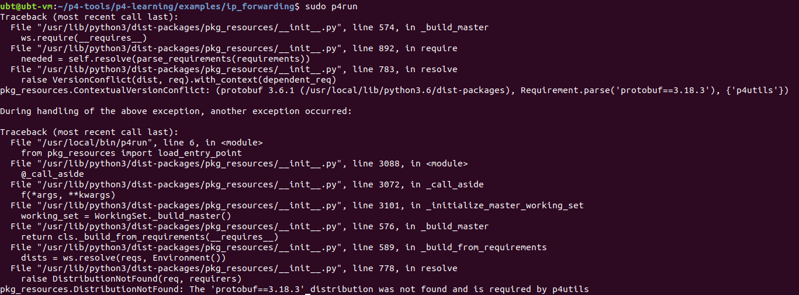

## 一、 安装P4（Ubuntu18环境）

官方指南：[p4-guide/README-install-troubleshooting.md at master · jafingerhut/p4-guide (github.com)](https://github.com/jafingerhut/p4-guide/blob/master/bin/README-install-troubleshooting.md)

挂个VPN，直接去这个地址下载预装P4环境的虚拟机就行。

文中说Ubuntu20使用`install-p4dev-v5.sh`安装脚本，Ubuntu18使用`install-p4dev-v4.sh` or `install-p4dev-v6.sh` 。


> [为ubuntu18.04配置P4环境_冲锋吧，少年的博客-CSDN博客](https://blog.csdn.net/m0_61817617/article/details/122296229)

P4 环境被分为多个子模块，需全部正确安装才能正常使用P4，如下图所示。

（其中protobuf 版本使用v3.6.1 `git checkout v3.6.1`，grpc版本使用v1.17.2 `git checkout tags/v1.17.2`）


准备一个VPN，我用的是clash，让它给ubuntu虚拟机设置代理。见https://zhuanlan.zhihu.com/p/380614384?ivk_sa=1024320u ， 如果使用clash，可以看评论区有简单方法。

这时就需要虚拟机连一个VPN代理，


然后就简单了。

- **将p4-utils下载到ubuntu中**

```cobol
git clone https://github.com/nsg-ethz/p4-utils.git
```

- 运行安装脚本

```cobol
cd p4-utils/install-tools
./install-p4-dev.sh
```

- 一切顺利最好，不然就去看文首的链接文章。

- 测试一个例程：

``` bash
~/p4-tools/p4-learning/examples/ip_forwarding$ sudo p4run
```

进入mininet，`h1 ping h2` 测试。

此时P4环境就搭建完了。

**但是**，当我们下载p4 tutorial的例程`git clone https://github.com/p4lang/tutorials.git` 。运行其中任意一个，结果如下所示：

``` bash
ubt@ubt-vm:~/tutorials/exercises/basic$ sudo make
mkdir -p build pcaps logs
p4c-bm2-ss --p4v 16 --p4runtime-files build/basic.p4.p4info.txt -o build/basic.json basic.p4
sudo python3 ../../utils/run_exercise.py -t pod-topo/topology.json -j build/basic.json -b simple_switch_grpc
Traceback (most recent call last):
  File "../../utils/run_exercise.py", line 28, in <module>
    import p4runtime_lib.simple_controller
  File "/home/ubt/tutorials/utils/p4runtime_lib/simple_controller.py", line 24, in <module>
    from . import bmv2, helper
  File "/home/ubt/tutorials/utils/p4runtime_lib/bmv2.py", line 15, in <module>
    from p4.tmp import p4config_pb2
ModuleNotFoundError: No module named 'p4.tmp'
../../utils/Makefile:35: recipe for target 'run' failed
make: *** [run] Error 1
```

提示我们没有找到`p4.tmp`模块。

我们使用命令`pip show p4`查看python 的p4模块安装的位置：


该目录中的p4是使用pip安装程序没有使用sudo导致包安在了用户目录下而不是系统目录下，我们应该避免该情况，同时我们查看该p4包发现内容不全：


接着发现python的系统安装目录`dist-packages`


与`site-packages`下都有p4包。


> 查看资料学习`dist-packages`与`site-packages`的区别。
>
> 简单来说
>
> - 如果是系统自带的python，会使用`dist-packages`目录；path: `/usr/local/lib/python3.6/dist-packages/`
>
> - 如果你手动安装python，它会直接使用目录`site-packages`。path ：`/usr/local/lib/python3.6/site-packages/`

终于在`site-packages`找到了我们需要的完整的p4模块了。

接着在终端使用：

``` python
ubt@ubt-vm:/usr/local/lib/python3.6/site-packages$ python
Python 3.6.9 (default, Nov 25 2022, 14:10:45) 
[GCC 8.4.0] on linux
Type "help", "copyright", "credits" or "license" for more information.
>>> import sys
>>> print(sys.path)
['', '/usr/lib/python36.zip', '/usr/lib/python3.6', '/usr/lib/python3.6/lib-dynload', '/usr/local/lib/python3.6/dist-packages', '/usr/local/lib/python3.6/dist-packages/thrift-0.11.0-py3.6-linux-x86_64.egg', '/usr/local/lib/python3.6/dist-packages/ptf-0.9.3-py3.6.egg', '/usr/local/lib/python3.6/dist-packages/six-1.16.0-py3.6.egg', '/home/ubt/p4-tools/p4-utils', '/usr/local/lib/python3.6/site-packages', '/usr/lib/python3/dist-packages']
```

可以看出`dist-packages`和`site-packages` 都是python系统目录，所以只需将python用户目录下的p4包删掉即可。使用`pip uninstall p4`删除。

还有另一种方法也可以，将完整正确的p4模块放在`/tutorials/utils/`，即 `cp -r /usr/local/lib/python3.6/site-packages/p4/   ~/tutorials/utils/`，让python程序直接在同级目录下引用p4包即可，但此方法拓展性较差，推荐上一种方法。

此时我们继续运行basic例程，发现没有包找不到p4的错了，而报新的错了：

``` bash
ubt@ubt-vm:~/tutorials/exercises/basic$ make
mkdir -p build pcaps logs
p4c-bm2-ss --p4v 16 --p4runtime-files build/basic.p4.p4info.txt -o build/basic.json basic.p4
sudo python3 ../../utils/run_exercise.py -t pod-topo/topology.json -j build/basic.json -b simple_switch_grpc
Traceback (most recent call last):
  File "../../utils/run_exercise.py", line 28, in <module>
    import p4runtime_lib.simple_controller
  File "/home/ubt/tutorials/utils/p4runtime_lib/simple_controller.py", line 24, in <module>
    from . import bmv2, helper
  File "/home/ubt/tutorials/utils/p4runtime_lib/bmv2.py", line 17, in <module>
    from .switch import SwitchConnection
  File "/home/ubt/tutorials/utils/p4runtime_lib/switch.py", line 21, in <module>
    from p4.v1 import p4runtime_pb2, p4runtime_pb2_grpc
  File "/home/ubt/tutorials/utils/p4/v1/p4runtime_pb2.py", line 17, in <module>
    from google.rpc import status_pb2 as google_dot_rpc_dot_status__pb2
  File "/usr/local/lib/python3.6/dist-packages/google/rpc/status_pb2.py", line 39, in <module>
    _STATUS = DESCRIPTOR.message_types_by_name["Status"]
AttributeError: 'NoneType' object has no attribute 'message_types_by_name'
../../utils/Makefile:35: recipe for target 'run' failed
make: *** [run] Error 1
```

在网上搜索该问题发现可能是protobuf版本太高了，查看其版本：

``` bash
ubt@ubt-vm:~/tutorials/exercises/basic$ pip show protobuf
Name: protobuf
Version: 3.18.3
Summary: Protocol Buffers
Home-page: https://developers.google.com/protocol-buffers/
Author: None
Author-email: None
License: 3-Clause BSD License
Location: /usr/local/lib/python3.6/dist-packages
Requires: 
```

查看`~/p4-utils/install-tools/install-p4-dev.sh`发现其中的安装文档发现`PROTOBUF_VER="3.6.1"`

于是卸载当前版本，下载3.6.1版本的。

``` bash
sudo pip uninstall protobuf
sudo pip install protobuf==3.6.1
```

然后运行例程，运行成功了。

此时运行p4-learning中的例程发现这里的例程需要 3.18.3 版本。



这里又报错了，无语。

反复测试发现，p4-learning例程一定需要protobuf3.18.3版本，tutorial例程用这个版本就不行，用protobuf3.6.1版本就可以。只能二选其一，暂时安装3.6.1版本吧。

sudo pip install protobuf==3.18.3

sudo pip install protobuf==3.6.1

 安装新版本会默认将旧版本删除
