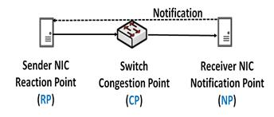
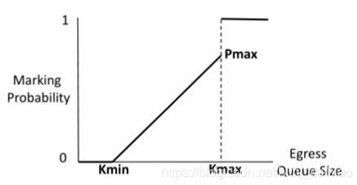
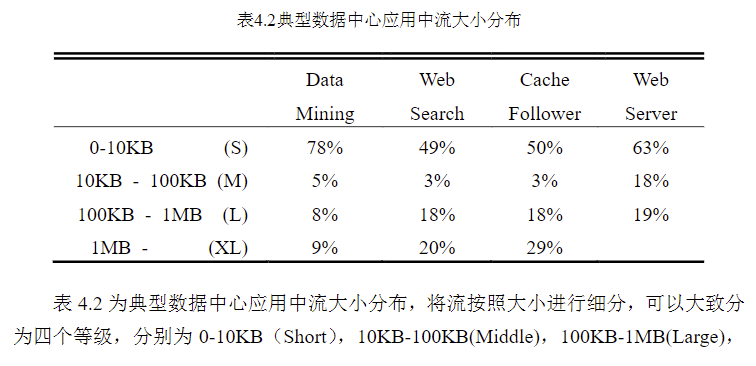

# linux内核CC算法学习

源码下载：[Index of /pub/linux/kernel/](https://mirrors.edge.kernel.org/pub/linux/kernel/) ，本文以 5.4.224 版本为例讲解。

在新下载的内核中，网络相关代码的位置：`usr/src/linux-x.x.xxx/net/`

在`tcp_ipv4.c`中，`tcp_prot`定义了tcp的各个接口。(如下所示)

``` c
struct proto tcp_prot = {
  .name = "TCP",
  .owner = THIS_MODULE,
  .close = tcp_close,
  .connect = tcp_v4_connect,
  .disconnect = tcp_disconnect,
  .accept = inet_csk_accept,
  .destroy = tcp_v4_destroy_sock,
  .shutdown = tcp_shutdown,
  .setsockopt = tcp_setsockopt,
  .getsockopt = tcp_getsockopt,
  .recvmsg = tcp_recvmsg,
  .sendmsg = tcp_sendmsg,
  .sendpage = tcp_sendpage,
  .backlog_rcv = tcp_v4_do_rcv,
  .get_port = inet_csk_get_port,
  .twsk_prot = &tcp_timewait_sock_ops,
  .rsk_prot = &tcp_request_sock_ops,
};
```

所有TCP拥塞控制算法都需要实现`tcp_congestion_ops`这样的结构，其定义位于 `/usr/src/linux-x.x.xxx/include/net/tcp.h`中。每一种拥塞控制算法实现这样的结构，然后向系统注册。系统将注册的拥塞控制算法组织成一个**单链表**。

可以在已有的若干拥塞控制算法中看到它们各自的实现，如：(`/usr/src/linux-x.x.xxx/include/ipv4/xxx.c`)

``` c
static struct tcp_congestion_ops bictcp __read_mostly = {	// tcp_bic.c 
	.init		= bictcp_init,
	.ssthresh	= bictcp_recalc_ssthresh,
	.cong_avoid	= bictcp_cong_avoid,
	.set_state	= bictcp_state,
	.undo_cwnd	= tcp_reno_undo_cwnd,
	.pkts_acked     = bictcp_acked,
	.owner		= THIS_MODULE,
	.name		= "bic",
};

struct tcp_congestion_ops tcp_reno = {  // tcp_cong.c
	.flags		= TCP_CONG_NON_RESTRICTED,
	.name		= "reno",
	.owner		= THIS_MODULE,
	.ssthresh	= tcp_reno_ssthresh,
	.cong_avoid	= tcp_reno_cong_avoid,
	.undo_cwnd	= tcp_reno_undo_cwnd,
};

static struct tcp_congestion_ops tcp_bbr_cong_ops __read_mostly = { // tcp_bbr.c
	.flags		= TCP_CONG_NON_RESTRICTED,
	.name		= "bbr",
	.owner		= THIS_MODULE,
	.init		= bbr_init,
	.cong_control	= bbr_main,
	.sndbuf_expand	= bbr_sndbuf_expand,
	.undo_cwnd	= bbr_undo_cwnd,
	.cwnd_event	= bbr_cwnd_event,
	.ssthresh	= bbr_ssthresh,
	.min_tso_segs	= bbr_min_tso_segs,
	.get_info	= bbr_get_info,
	.set_state	= bbr_set_state,
};
```

TCP头部字段`tcphdr`定义位置：`usr/src/linux-x.x.xxx/include/uapi/tcp.h`

机器收到数据包后的处理过程的主程序在`usr/src/linux-x.x.xxx/net/ipv4/ip_input.c/*ip_rcv_core`函数中

在  `usr/src/linux-x.x.xxx/net/ipv4/tcp_input.c/tcp_rcv_state_process()`中，6306行，将发送窗口改为接收到的包的cwnd。（原本就有的）


## 网络核心数据结构

### sock 底层数据结构

#### `sock`

- 位置：`/include/net/sock.h`

- sock 结构是比较通用的网络层描述块，构成传输控制块的基础，与具体的协议族无关。它描述了各协议族的公共信息，因此不能直接作为传输层控制块来使用。不同协议族的传输层在使用该结构的时候都会对其进行拓展，来适合各自的传输特性。例如，**`inet_sock`结构由sock 结构及其它特性组成，构成了IPV4 协议族传输控制块的基础。**

#### `sk_buff`

- 位置：`/include/linux/skbuff.h`

- `struct sk_buff - socket buffer`:这一结构体在各层协议中都会被用到。该结构体存储了**网络数据报的所有信息**。包括各层的头部以及payload，以及必要的各层实现相关的信息。在文件中对skb的属性进行了详细解释。

### inet 层相关数据结构

#### `ip_options`

- 位置：`/include/net/inet_sock.h`

- 定义ip头的可选项

#### `inet_connection_sock`

- 位置：`/include/net/inet_connection_sock.h`

- 它是所有面向传输控制块的表示。其在`inet_sock`的基础上，增加了有关连接，确认，重传等成员

### TCP 层相关数据结构

#### `tcphdr`

- 位置：`/include/uapi/tcp.h`

- 这一结构正是TCP 首部及各个字段定义。

#### `tcp_options_received`

- 位置：`/include/linux/tcp.h`

- TCP 头部的选项字段。

#### `tcp_sock` 

- 位置：`/include/linux/tcp.h`

- 该数据结构是TCP 协议的控制块，它在`inet_connection_sock`结构的基础上扩展了滑动窗口协议、拥塞控制算法等一些TCP 的专有属性


## TCP Option

TCP Option 解释：[常用的TCP Option_blakegao的博客-CSDN博客](https://blog.csdn.net/blakegao/article/details/19419237)

TCP选项字段构造：[TCP/IP OPTION字段 - 莫扎特的代码 - 博客园 (cnblogs.com)](https://www.cnblogs.com/codingMozart/p/9067552.html)

解析收到的数据包的option字段的位置在：`net/ipv4/tcp_input.c/tcp_parse_options`

一般Option的格式为TLV结构，如下所示：

| Kind / Type（1 Byte） | Length（1 Byte）[整个这个选项段的总长度] | Value |
| --------------------- | ---------------------------------------- | ----- |

当前，TCP常用的Option如下所示：

| Kind(Type) | Length | Name                                                         | Reference | 描述 & 用途                                |
| ---------- | ------ | ------------------------------------------------------------ | --------- | ------------------------------------------ |
| 0          | 1      | EOL                                                          | RFC 793   | 选项列表结束                               |
| 1          | 1      | NOP                                                          | RFC 793   | 无操作（用于补位填充）                     |
| 2          | 4      | MSS                                                          | RFC 793   | 最大Segment长度                            |
| 3          | 3      | WSOPT                                                        | RFC 1323  | 窗口扩大系数（Window Scaling Factor）      |
| 4          | 2      | SACK-Premitted                                               | RFC 2018  | 表明支持SACK                               |
| 5          | 可变   | SACK                                                         | RFC 2018  | SACK Block（收到乱序数据）                 |
| 8          | 10     | TSPOT                                                        | RFC 1323  | Timestamps                                 |
| 19         | 18     | TCP-MD5                                                      | RFC 2385  | MD5认证                                    |
| 28         | 4      | UTO（RFC 5482: TCP option to announce/request UTO Not yet implemented in Linux） | RFC 5482  | User Timeout（超过一定闲置时间后拆除连接） |
| 29         | 可变   | TCP-AO                                                       | RFC 5925  | 认证（可选用各种算法）                     |
| 253/254    | 可变   | Experimental                                                 | RFC 4727  | 保留，用于科研实验                         |

注：

> 1.    EOL和NOP Option（Kind 0、Kind 1）只占1 Byte，没有Length和Value字段；
> 2.    NOP用于 将TCP Header的长度补齐至32bit的倍数（由于Header Length字段以32bit为单位，因此TCP Header的长度一定是32bit的倍数）；
>3.    SACK-Premitted Option占2 Byte，没有Value字段；
> 4.    其余Option都以1 Byte的“Kind”开头，指明Option的类型；Length指明Option的总长度（包括Kind和Length）
>5.    对于收到“不能理解”的Option，TCP会无视掉，并不影响该TCP Segment的其它内容；
> 5.    自己新增可选项字段时，需要修改IP头中的总长度字段，TCP头中的offset字段，并且修改TCP的校验和。如果知识修改字段的话就需要重新计算TCP的校验和。


## 简称查询

| **简称**    | **含义**                                                     |
| ----------- | ------------------------------------------------------------ |
| **ca**      | congestion control algorithm 拥塞控制算法                    |
| tp          | tcp_sock                                                     |
| th          | tcphdr  , tcp 头部字段                                       |
| icsk        | inet_connection_sock                                         |
| icsk_ca_ops | inet_connection_sock congestion control algorithm options，当前网络连接所采用的拥塞控制算法。 |
| snd_cwnd    | 拥塞窗口                                                     |
| snd_wnd     | 当前发送窗口                                                 |
| snd_nxt     | 下一个发送序号                                               |
| snd_una     | 最早的未确认序号                                             |
| ihl         | ip header length  ： ip头部长度                              |
| TCPOLEN     | TCP OPTION LENGTH                                            |
|             |                                                              |

上面的snd_wnd、snd_una、snd_nxt三个字段组成了滑动窗口（已发送还未确认的包in_flight，以及即将发送的包）。 如下图所示：


拥塞窗口`cwnd`：防止**过多的数据注入到网络中**导致网络发生拥塞。

发送窗口（滑动窗口）`swnd`：防止源端发送过去，收端却接收不过来。

接收窗口`rwnd`：放在ACK中的窗口字段的值，收端告诉源端自己还能接收多少。

发送窗口的值 **`swnd = min(cwnd, rwnd)`**


## lkseagle代码修改的部分

`/usr/src/linux-5.4.224/net/ipv4/tcp_cong.c/tcp_reno_cong_avoid()` 函数， // 都是我自己注释的， /\*官方自己的 注释\*/

下面这些都是新增的

``` c
	if(tp->rx_opt.my_wnd){
		tp->snd_cwnd = tp->rx_opt.my_wnd << tp->rx_opt.snd_wscale;
		printk("my_wnd is ok!");
	}
	else{
		tp->snd_cwnd=10;
	}
	printk("cwnd:%d,my_wnd:%d,snd_wscale:%d \n", tp->snd_cwnd, tp->rx_opt.my_wnd, tp->rx_opt.snd_wscale);
```


`/usr/src/linux-5.4.224/include/linux/tcp.h/tcp_options_received`  结构体，在最后增加了自定的my_wnd

`usr/src/linux-x.x.xxx/net/ipv4/tcp_input.c/tcp_parse_options()` 解析可选字段的函数中，为了使我们新增的my_wnd字段能够解析，3980-3983 增加了 if 里面的解析。同时还有这个函数中新增了7个 printk 打印输出。（ctrl + F 找到可以删除）


# 其他新型拥塞控制算法

### DCTCP

- **背景**：数据中心中存在三种形式的流：**查询流、短流、长流**。其中查询流和短流对延迟敏感，需要能够容忍高突发丢包，长流需要较高的吞吐量。但是因为数据中心的交换机中有限的可用缓冲区空间，这样就导致延迟敏感的流可能被排在长流的后面，从而造成应用程序的高延迟。

- **Data Center中主要的性能损害**：

    incast：对于查询流而言，many-to-one的通信模式导致在聚集交换机处发生拥塞

    Queue buildup：长流对缓存区的占用，导致短流排队

    Buffer pressure：共享的缓存区，导致其他端口的长流影响本端口的短流的传输

- **DCTCP思想**：利用网络中的显式拥塞通知（ECN）向终端主机提供多位反馈。在保证长流吞吐量的前提下，保持交换机缓冲区较低的占用率。

- **算法**：

    1. 我们在交换机处设置阈值 K ，如果数据包达到交换机时，其队列占用值大于K，则在CE点标记该数据包。
    2. 接收端收到ECN标记的数据包后，回传带有ECE（ECN-echo）标记的ACK给发送端，发送端根据规则调节发送窗口，实现拥塞避免。（并不是由交换机直接告诉发送端自己快拥塞了）
    3. 发送方根据到达的标记的包的比例，来调整拥塞窗口的大小。DCTCP的核心是拥塞程度 α 的估计， 在每次发送完一个窗口后（一个RTT）更新：
    4. `F`为当前窗口内包被标记ECN的比例。每收到一个有ECN标记的数据包，发送方按以下公式调节拥塞窗口：
    5. 当 α 趋近于1时，表示拥塞非常剧烈，与原始的TCP算法相同，DCTCP会将拥塞窗口减半；当α很小时，表示发生的拥塞十分轻微，此时拥塞窗口就不会受太大影响。

- **结果**：①DCTCP对比TCP同时使用的缓冲区空间少了90%；②DCTCP能够为短流提供低延迟和高突发容忍度；③在很大程度上缓解了incast的问题。

### QCN

QCN（Quantized Congestion Notification，量化拥塞通知）是一套应用于L2的端到端拥塞通知机制，通过**主动反向通知**，降低网络中的丢包率和延时，从而提高网络性能。(目前在RoCEv2网络中大热的DCQCN拥塞控制算法就是QCN和DCTCP相互结合形成的)

#### 1 QCN的基本概念

QCN算法由很多部分组成，先来了解一下这些部分的名称和概念

- RP（Reaction Point）：数据流的发送端，指代网卡，支持QCN协议。
- CP（Congestion Point）：使能QCN功能的网络交换设备，可以进行拥塞信息检测。
- CNM（Congestion Notification Message）：网络设备检测发生拥塞后发送给数据流源端的报文。关于报文的组成可以下次给大家细讲。
- CCF（Congestion Controlled Flow）：在某队列使能QCN后将会作用的流，后面我们统称拥塞控制流。
- QntzFb（Quantized Feedback）：表明拥塞程度的量化的反馈值，长度固定为6个比特。

#### 2 QCN思想

量化拥塞通知QCN主要有两部分算法组成，CP算法和RP算法。

- ***CP算法***：（在交换机）发生拥塞的网络交换设备（交换机）对正在发送缓存中准备发送的数据帧进行取样。如果发现出现拥塞，将会产生一个拥塞通告消息（CNM）给被取样的数据帧的发送端RP（直接给发端发送消息)。
- ***RP算法***：（在发送端）当RP收到CNM信息以后会对相应报文的**发送速率进行限制**，同时RP也会慢慢增加其发送速率来进行**可用带宽的探测**和恢复由于拥塞而"损失"的速率。当一直没收到CNM时发端为了获得更大的带宽利用率会采用快速恢复和主动增加策略。

- 具体算法细节：[QCN拥塞控制算法 - 知乎 (zhihu.com)](https://zhuanlan.zhihu.com/p/142838792)

QCN不能用于IP路由网络中，因为流的定义完全基于L2地址。 在IP路由网络中，当数据包通过网络传输时，以太网包头在不断更新，原始的以太网报头不会保留，拥塞的交换机无法确定导致其拥塞的源目标目标，所以QCN在大规模IP网络中无法部署使用，但是这并不能影响它算法中依然存由很多可取之处，后来DCQCN的出现无疑就是最好的例子。

### DCQCN

DCQCN全称为Data Center Quantized Congestion Notification，是目前在RoCEv2网络中使用最广泛的拥塞控制算法，**它融合了QCN算法和DCTCP算法**，DCQCN只需要可以支持WRED和ECN的数据中心交换机（市面上大多数交换机都支持），其他的协议功能在端节点主机的NICs上实现。DCQCN可以提供较好的公平性，实现高带宽利用率，保证低的队列缓存占用率和较少的队列缓存抖动情况。 




- **交换机（CP，congestion point）**
    CP算法与DCTCP相同，如果交换机发现出端口队列超出阈值，在转发报文时就会按照一定概率给报文携带ECN拥塞标记（ECN字段置为11），以标示网络中存在拥塞。标记的过程由WRED（Weighted Random Early Detection）功能完成。

    WRED是指按照一定的丢弃策略随机丢弃队列中的报文。它可以区分报文的服务等级，为不同的业务报文设置不同的丢弃策略。WRED在丢弃策略中设置了报文丢包的高/低门限以及最大丢弃概率，（该丢弃概率就是交换机对到达报文标记ECN的概率）。并规定：

    1. 当实际队列长度低于报文丢包的低门限值时，不丢弃报文，丢弃概率为0%。

    2. 当实际队列长度高于报文丢包的高门限值时，丢弃所有新入队列的报文，丢弃概率为100%。

    3. 实际队列长度处于报文丢包的低门限值与高门限值之间时，随机丢弃新到来的报文。随着队列中报文长度的增加，丢弃概率线性增长，但不超过设置的最大丢弃概率。 

        

- **接收端（NP，notification point）**

    接收端NP收到报文后，发现报文中携带ECN拥塞标记（ECN字段为11），则知道网络中存在拥塞，因此向源端服务器发送CNP拥塞通知报文（Congestion Notification Packets），以通知源端服务器进行流量降速。

    NP算法说明了CNPs应该什么时间以及如何产生：如果某个流的被标记数据包到达，并且在过去的N微秒的时间内没有相应CNP被发送，此时NP立刻发送一个CNP。NIC每N微秒最多处理一个被标记的数据包并为该流产生一个CNP报文。 

- **发送端（RP，reaction point）**
    当发送端RP收到一个CNP时，RP将减小当前速率Rc，并更新速率降低因子α，和DCTCP类似，并将目标速率设为当前速率，更新速率过程如下：

    `RT = Rc`

    `Rc = Rc * ( 1 -α/2 )`

    `α = ( 1-g )*α+g`

    如果RP在K微秒内没有收到CNP拥塞通知，那么将再次更新α，此时α = ( 1 -g ) * α。注意K必须大于N 即K必须大于CNP产生的时间周期。

    进一步，RP增加它的发送速率，该过程与QCN中的RP相同。

### timely-sigcomm15

本文认为：数据中心中，***简单的数据包延迟（以主机的往返时间来衡量）是一种有效的拥塞信号，无需交换机反馈。***首先，我们证明了NIC硬件的进步使得RTT的测量精度达到了微秒级，并且这些RTT足以估算交换机的排队时间。然后，作者描述TIMELY如何使用RTT梯度来调整传输速率，以在提供高带宽的同时保持较低的数据包延迟。 据我们所知，**TIMELY是第一个用于数据中心的基于延迟的拥塞控制协议**，尽管它的RTT信号（由于NIC卸载）比以前的基于延迟的方案少了一个数量级，但是TIMELY仍能实现其结果。

基于延迟的方案往往与更具攻击性的基于损失的方案竞争较弱。

本方案的**出现契机**在于NIC的最新发展确实允许以足够的精度来测量数据中心RTT，使用RTT变化率或梯度来预测拥塞的发生，从而在提供高吞吐量的同时将延迟保持在较低水平。（当然还是只是用于DC中不适用于广域网）

[ sigcomm 2015 timely 论文阅读](https://blog.csdn.net/qq_21125183/article/details/104657860)

### ExpressPass

ExpressPass: End-to-End Credit-based Congestion Control for Datacenters

ExpressPass 是一种端到端的 credit 调度的，时延有界限的拥塞控制方案。ExpressPass 使用 credit 包控制速率，调度到达的数据包。接收端在每条流的基础上发送 credit 包给发送端，交换机限制每条链路上的 credit 包速率并决定相反方向上数据分组可获得的带宽。通过影响网络中 credit 包流，系统主动地控制拥塞，甚至是在发送数据包之前。发送端很清楚适合发送的流的量，而不是等包发完以后响应拥塞信号。这种方法能够快速提升 credit 流发送速率而不用担心数据分组丢失。另外，它能够很好的解决 incast 问题，因为瓶颈链路上 credit 包的到达顺序自然地调度相反路径上数据分组的到达，以分组的粒度。

ExpressPass 通过 credit 调度，使得一个发送端仅在收到接收端的 credit 分组后才会发送数据分组。当数据分组到达发送端，发送端如果有数据分组就发送，如果没有就忽略 credit 分组。ExpressPass 通过在交换机处限制 credit 分组速率来控制拥塞而不引入流状态，这高效的调度了瓶颈链路上的响应分组，限制队列堆积并不依赖于中央控制器。即使在分割汇聚负载下，基于 credit 的调度方式仍然保证最大队列堆积受限。


### HPCC-sigcomm19

HPCC（High Precision Congestion Control，高精度拥塞控制），可以同时实现低时延、高带宽和网络稳定性。针对的问题是数据中心网络的性能瓶颈不是出现在计算设备中而是出现中网络传输中。

**HPCC利用网络遥测（INT）获得精确的链路负载信息并精确控制流量。**关键设计选择是依靠交换机提供细粒度的负载信息，例如队列大小和累积的tx/rx流量，以计算精确的流量。

HPCC的两个优势：（i）HPCC可以快速收敛到适当的流量，从而在避免拥塞的同时高度利用带宽；和（ii）HPCC可以持续保持接近零的队列，以实现低延迟

以前方法不行的根本原因是遗留网络中缺乏细粒度的网络负载信息：ECN是终端主机可以从交换机获得的唯一反馈，RTT是一种纯粹的端到端测量，没有交换机的参与。

**HPCC架构实现**：HPCC是一个发送方驱动的CC框架。如下图所示，发送方发送的每个数据包都将由接收方确认。在数据包从发送方传播到接收方的过程中，路径沿线的每个交换机利用其交换ASIC的INT特性插入一些元数据，这些元数据报告数据包出口的当前负载，包括时间戳（ts）、队列长度（qLen）、传输字节（txBytes）和链路带宽容量（B）。

当接收方收到数据包时，它会将交换机记录的所有元数据复制到发送回发送方的ACK消息中。发送方决定在每次收到带有网络负载信息的ACK时如何调整其流量。


HPCC的两个核心设计点:

- 基于inflight bytes的发送端速率控制：
- RTT-based与ACK-based反馈结合避免overreaction：

###  PCN-NSDI 2020

*Re-architecting Congestion Management in Lossless Ethernet* 

PCN揭示现有拥塞控制方法在长短流混合的场景下的存在问题：短流的特点是由于长度小于网络的时延带宽乘积（BDP），当发送方被通知拥塞时，短流已经发送完毕，造成短流不被端到端拥塞控制所控制。这种突发性的流量在无损以太网中，只能靠逐跳的PFC所控制，而长流是由端到端拥塞控制所控制的。


**现有的问题：**

- **PFC干扰拥塞探测与识别** ：F0的吞吐降低造成性能损失，原因就是拥塞从P2扩展到P0，扩展的标志就是PFC开始起作用，形成拥塞树。P0收到了PAUSE帧，造成P0队列累积。此时的队列累积并不是因为P0处发生了拥塞，P0是victim port。而在现有的拥塞控制协议均将队列长度作为拥塞信号，所以造成拥塞信号不准，端上的拥塞控制会误把F0当做造成拥塞的流进行降速。

- **逐步的端到端速率调节与逐跳的流控不匹配**

    拥塞扩展的根本原因就是造成拥塞的流没有及时快速地减到合适的速率。换句话说，如果速率减的够快，就不会有拥塞扩展出现。无损以太网中，一个好的拥塞控制算法应当尽可能少的减少PFC的触发（可以阅读[DCQCN](https://conferences.sigcomm.org/sigcomm/2015/pdf/papers/p523.pdf)中关于阈值设置的内容进行理解，同时注意DCQCN也说，它并不能保证PFC完全不触发）。本实验中，拥塞控制协议应当将F1快速减到正确的速率，但是由于现有算法的调节都是逐步的，而PFC是逐跳传播的，所以还是出现了从P1到P0的拥塞扩展。

##### Design

针对三个问题，PCN有三个核心设计点：

- **准确探测congested flow** （就是真正造成拥塞的流）

    已有的拥塞控制算法，只根据队列长度来识别congested flow （[Timely](https://yi-ran.github.io/2019/03/27/Timely-NSDI-2015/)根据RTT，本质上也是队长），当网络中PFC没有被触发时，根据队长是准的，但是如果PFC被触发，端口队长累积既可能是因为这个端口就是拥塞发生的端口，也可能因为这个端口经历了拥塞扩展，被pause住导致到达的数据包累积。因此，PCN中对端口状态进行了划分，分成了三种，非拥塞、准拥塞以及真拥塞。重点是对准拥塞端口的理解。准拥塞的端口处于一个在不断收到PAUSE和RESUME帧的阶段，端口的输出速率小于线速，输入速率取决于流量。

    

    交换机标记核心思想：`被PAUSE住的数据包不标`

    

    仅通过交换机标记是不够的，因为在连续的PAUSE RESUME之间的数据包仍可能会被标记。因此PCN将真正的拥塞识别放到接收端去做：

    如果是真拥塞端口，真拥塞流的数据包一定会连续的被标记；准拥塞端口的数据包一定不被连续标记，根据这一特征，由接收端区分谁是真正的拥塞流

- **receiver-driven的减速，使congested flow直接减速到合适的速率**

    这里文章指出了，针对无损以太网，造成拥塞的流的正确速率就是它在接收方的接收速率。这一点需要好好理解。可以说，采用拥塞流的接收速率来指导减速是彻底的解决方法。最简单的例子就是多对一的incast场景。实际上复杂的场景下这个思想也是正确的。对任意一条拥塞流，它的接收速率就是能通过瓶颈的最大速率。

- **先缓慢后激进的增速策略**

    文章作者启发式设计了一个先缓慢后激进的增长函数

    


### Swift-sigcomm20

论文题目：`Swift: Delay is Simple and Effective for Congestion Control in the Datacenter`

swift由timely发展而来；与其他工作相比，Swift以利用延迟的简单性和有效性而著称。使用时延作为拥塞的信号（因为网卡技术发展可提供非常精准的时延测量）。可轻松部署在现在的交换机中。

Swift通过使用AIMD实现端到端控制。

**实现的效果**是在较低时延的情况下仍然保持高吞吐量。


**优点**：

- 将拥塞更细粒度地划分为结构拥塞和端点拥塞。
- 对不同的流使用不同的目标延迟提高了公平性。
- 使用分数拥塞窗口和pacing delay来缓解大规模incast。
- 将RTT拆分为结构部分和主机部分可以更快地在调试中找到问题所在。

**缺点**：

- 网络中的延迟和噪声会影响研策的准确性。
- 不同协议 之间的公平性问题。


**PFC**（Priority-based Flow Control，基于优先级的流量控制）是目前应用最广泛的能够有效避免丢包的流量控制技术，是智能无损网络的基础。使能了PFC功能的队列，我们称之为无损队列。当下游设备的无损队列发生拥塞时，下游设备会通知上游设备会停止发送该队列的流量，从而实现零丢包传输。


**Incast congestion problem**：大量的请求同时到达前端服务器，或者数据中心服务器同时向外发送大量的数据，造成交换机或路由器缓冲区占满，从而引发大量丢包。TCP重传机制（TCP中收到连续三个AC K包表示拥塞）又需要等待超时重传，增加了整个系统的时延，同时大大削减了吞吐量。


**问题出现原因**：

- 大量数据同时进出网络
- 交换机缓存区有限

**解决方案**：

- 聚合热点数据对象：动态的将热点话题或相关度高的数据对象聚集在少数几个服务器上，这样前端服务器和后端服务器的连接数量就减少了，同时也降低了数据查询时延。
- 减少排队时延：使用SRTF（最短剩余时间优先调度算法）将高优先级分配给具有更小尺寸，更短等待时间的数据对象，优先传输这些数据，从而减少的平均响应时间。
- 发送拥塞后发端减少发送窗口大小。 

**INT(Inband Network Telemetry)** 带内网络遥测技术是一种主被动混合测量技术，从根本上来说就是一种借助数据面业务进行网络状况的收集、携带、整理、上报的技术，不使用单独的控制面管理流量进行上述信息收集。

通过技术名称也可以看出此项技术的两个关键点：

- **Inband**（带内），意味着借助数据面的业务流量，而不是像很多协议那样专门使用协议报文来完成协议想要达到的目的，
- **Telemetry**（遥测），体现为测量网络的数据并远程上报的特点。


一般来说，一个INT域中包含3个主要的功能节点，分别是INT Source、INT Sink和INT Transit Hop。其中INT Source、INT Sink可认为是遥测线路的起点和终点，INT Source负责指出需要收集信息的流量和要收集的信息，INT Sink负责将收到的信息进行整理并上报给监控设备；INT Transit Hop则可认为是线路上支持INT遥测的所有设备。

对遥测管理者来说，需要进行遥测的业务流量会在source节点上增加一个INT头部，其中带有指明需要收集信息类型的指令集（INT Instruction），从而成为一个INT报文，在到达关心的INT Transit Hop节点时，会根据指令集把收集到的信息（INT Metadata）插入INT报文，最终在INT Sink节点上弹出所有的INT信息并发送给监测设备。

对业务用户来说，上述INT对流量的处理过程，是完全透明的，用户不能也不需要去感知这些信息。

除此之外，INT2.0协议较此前的旧有协议，定义了新的转发模式，其中提到了如Flow Watchlist（INT设备上INT instruction 组成的集合）等新的概念，在为下一步INT技术的发展做准备。

**工作原理**

INT2.0协议中规定了三种工作模式，分别为：INT-MD、INT-MX和INT-XD，其中INT-MD即为从协议诞生之初的经典工作模式，另外两种为协议2.0中新增说明的模式，除大致工作原理外尚无详细定义。

- INT-MD(eMbed Data)/Hop-by-Hop


INT-MD模式数据包处理流程如下：

1. 普通数据报文到达INT系统的source交换节点时，INT模块通过在交换机上设置的采样方式匹配出该报文，根据[数据采集](https://cloud.tencent.com/solution/data-collect-and-label-service?from=10680)的需要在指定位置插入INT头部，包含instruction，同时将INT头部所指定的遥测信息封装成元数据（MetaData，MD）插入到INT头部之后；

2. 报文转发到Transmit Hop节点时，设备匹配INT头部后按指令插入相应的MD；

3. 报文转发到带内网络遥测系统的Sink节点时，交换设备匹配INT头部插入最后一个MD并提取全部遥测信息并通过gRPC等方式转发到遥测[服务器](https://cloud.tencent.com/product/cvm?from=10680)，将源数据报文复原并进行正常转发处理。

[网络遥测知多少之INT篇 - 腾讯云开发者社区-腾讯云 (tencent.com)](https://cloud.tencent.com/developer/article/1643482)

时延带宽乘积（BDP）指的是一个数据链路的能力（每秒比特）与来回通信延迟（秒）的乘积。其结果是以比特（或字节）为单位的一个数据总量，等同在任何特定时间该网络线路上的最大数据量——已发送但尚未确认的数据。


目标：低时延，高带宽

排队时延是流完成时间的重要组成部分，而基于队列的拥塞控制方案对时延并不敏感，无法有效监测或限制分组排队时延，造成不理想的流完成时间性能。




